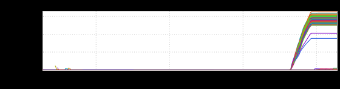
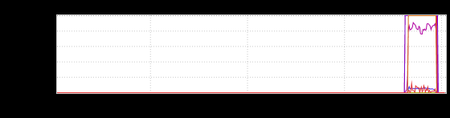
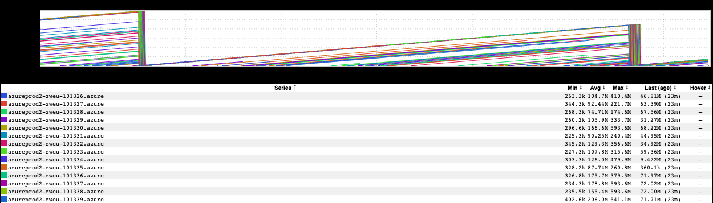
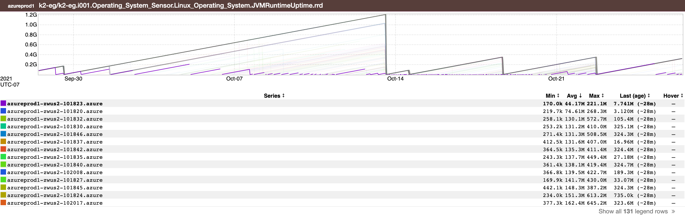
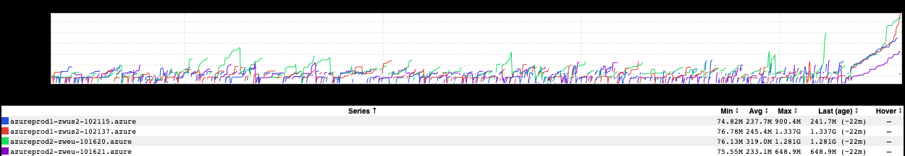
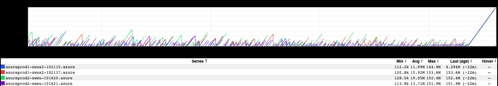

+++
title = "Unintentional Art (November 2021)"
date = "2021-11-05"
slug = "unintentional-art-november-2021"
draft = false
+++

Let's take a peek at a few bits 'n' bobs from my "stash" today.

First up, a nice lil angular rainbow - one that I guess decided to "bend" instead of "curve":

Next, there's one I've entitled "The Espresso Guillotine":

The next pair of graphs are actually related to one another. I was trying to identify (automated) restart behavior on a particular host. I started off looking at this:

Okay, so that looks kinda cool, but it's a little hard to figure out exactly what's going on. It charts JVM uptime, and taken as a whole it doesn't look too unreasonable - I'd expect it to follow some regular cadence of growth with regular dropoffs due to deployment activity, and that's precisely what we see.

...but what if we wanted to dig? What if we back out a bit, sort by average uptime, and then focus in on the one with the lowest average?

Huh. Lookit that little purple guy down there at the bottom, just sorta struggling to stay alive. What's going on with him?

Betcha he's unhappy.

Different service, different set of graphs...similar sort of deal:

Man, that looks fuckin' cool, but...huh...it's not necessarily what I would've expected. Let's see what uptime looks like:

Oof. I mean, I guess it's *possible* that this service has been deployed once every few hours (on average) over the course of the past couple of months...but it seems more likely that this is unhealthy behavior being propped up by automation (read: Nurse), eh?

If you've read this far, I'd actually like to crowdsource an answer to the question: What signal might exist that this kind of thing is happening? That one - or *a* *ll* - of your instances are being regularly restarted, and this may be a problem (assuming this isn't expected behavior)? Fundamentally, what primitives might we have around "if an event happens once it's fine, but if it happens more than X times in Y timeframe then it may deserve some additional eyeballs"?
