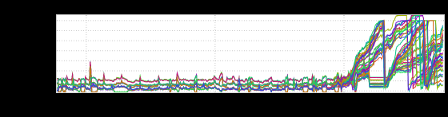
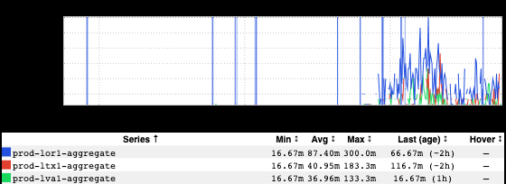
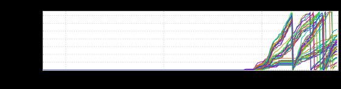

+++
title = "Drip. Drip."
date = "2021-12-03"
slug = "drip-drip"
draft = false
+++

When we're talking about a resource leak, often the resource we're talking about is memory. However, this needn't always be the case.

Sometimes it's threads.

The scale might be a little hard to grok, but the above is an example of a slow thread leak. How slow? Something on the order of a few threads an hour per instance. With a jetty threadpool size of 150 this particular leak would take a couple of days to chew through the entire threadpool on a given instance and render it useless until restarted.

No recent deployments, no lix ramps - in short, nothing that might indicate what changed, nothing to revert to see if it mitigated impact.

...and it's the Monday before Thanksgiving, so if we don't fix this someone's gonna have to babysit it over the weekend.

Swell.

Taking a peek at a thread dump for an impacted instance revealed ~150 threads with an identical stack (abbreviated for...err...brevity):

"qtp1321115948-364731" #364731 prio=5 os_prio=0 cpu=16057.22ms elapsed=257.99s tid=0x00007fcbec012000 nid=0x792b waiting on condition  [0x00007fcb0cdcc000] java.lang.Thread.State: WAITING (parking) at jdk.internal.misc.Unsafe.park(java.base@11.0.8/Native Method) - parking to wait for  <0x00000007d3a30438> (a java.util.concurrent.CountDownLatch$Sync) at java.util.concurrent.locks.LockSupport.park(java.base@11.0.8/LockSupport.java:194) at java.util.concurrent.locks.AbstractQueuedSynchronizer.parkAndCheckInterrupt(java.base@11.0.8 /AbstractQueuedSynchronizer.java:885) at java.util.concurrent.locks.AbstractQueuedSynchronizer.doAcquireSharedInterruptibly(java.base@11.0.8 /AbstractQueuedSynchronizer.java:1039) at java.util.concurrent.locks.AbstractQueuedSynchronizer.acquireSharedInterruptibly(java.base@11.0.8 /AbstractQueuedSynchronizer.java:1345) at java.util.concurrent.CountDownLatch.await(java.base@11.0.8/CountDownLatch.java:232) at com.linkedin.common.callback.FutureCallback.get(FutureCallback.java:62) at com.linkedin.restligateway.core.dispatcher.impl.DefaultRequestDispatcher.dispatch (DefaultRequestDispatcher.java:74)

Furthermore, taking a thread dump with 10 samples - each 15 seconds apart - and then looking at any one of these threads looked something like this:

"qtp1321115948-364731" #364731 prio=5 os_prio=0 cpu=7627.57ms elapsed=122.93s tid=0x00007fcbec012000 nid=0x792b waiting on condition  [0x00007fcb0cdcc000] "qtp1321115948-364731" #364731 prio=5 os_prio=0 cpu=9125.53ms elapsed=137.61s tid=0x00007fcbec012000 nid=0x792b waiting on condition  [0x00007fcb0cdcc000] "qtp1321115948-364731" #364731 prio=5 os_prio=0 cpu=10255.85ms elapsed=152.74s tid=0x00007fcbec012000 nid=0x792b waiting on condition  [0x00007fcb0cdcc000] "qtp1321115948-364731" #364731 prio=5 os_prio=0 cpu=11205.46ms elapsed=167.59s tid=0x00007fcbec012000 nid=0x792b waiting on condition  [0x00007fcb0cdcc000] "qtp1321115948-364731" #364731 prio=5 os_prio=0 cpu=12037.48ms elapsed=183.32s tid=0x00007fcbec012000 nid=0x792b waiting on condition  [0x00007fcb0cdcc000] "qtp1321115948-364731" #364731 prio=5 os_prio=0 cpu=12784.81ms elapsed=198.36s tid=0x00007fcbec012000 nid=0x792b waiting on condition  [0x00007fcb0cdcc000] "qtp1321115948-364731" #364731 prio=5 os_prio=0 cpu=13756.55ms elapsed=212.67s tid=0x00007fcbec012000 nid=0x792b waiting on condition  [0x00007fcb0cdcc000] "qtp1321115948-364731" #364731 prio=5 os_prio=0 cpu=14371.89ms elapsed=228.00s tid=0x00007fcbec012000 nid=0x792b waiting on condition  [0x00007fcb0cdcc000] "qtp1321115948-364731" #364731 prio=5 os_prio=0 cpu=15123.34ms elapsed=242.81s tid=0x00007fcbec012000 nid=0x792b waiting on condition  [0x00007fcb0cdcc000] "qtp1321115948-364731" #364731 prio=5 os_prio=0 cpu=16057.22ms elapsed=257.99s tid=0x00007fcbec012000 nid=0x792b waiting on condition  [0x00007fcb0cdcc000]

Hmm...okay. So the same thread stuck waiting on the same condition for (at least) 150 seconds, and poking at the code it looks like it's waiting on a rest.li call...but a call to what downstream? ...and why isn't it just timing out and getting cleaned up like a good little thread?

I wonder what upstream (ATS) thinks about all of this?

Okay, so it's timing out reads - that makes sense. (Side note: The [informed overlay vertical bars in this screenshot proved to be utterly unrelated.)](/igotw/2020-07-02-informed-overlay-redux/)

How about downstream?

Spot-checking 3-4 of these threads in a heap dump (which I sadly do not have a good screenshot of) revealed that all of them seemed to be wedged on a call to the /networkSizes endpoint in cloud-session. Okay, let's see if there's any corroborating evidence in inGraphs, shall we?

Outstanding requests, start time, and concurrency for those particular requests - consider the thing corroborated! ...so now we have some idea about the What...but what about the Why?

_Well, after some more digging (mad props to Sanjeev Ojhafor this find!) the _[Paul Harvey here is something like the following:](https://en.wikipedia.org/wiki/The_Rest_of_the_Story)

1. Some client out there In the Wild started making calls that included an [Expect: 100-Continue](https://developer.mozilla.org/en-US/docs/Web/HTTP/Headers/Expect) header

2. Our service (restli-gateway) accepted the request and responded with a 100 Continue

3. Our service *also* passed the Expect header on to the downstream service

4. The downstream service (cloud-session) responded with its *own* 100 Continue

5. Our service logged a warning about a downstream error: "onStreamError: ex: com.linkedin.r2.message.stream.StreamException (Received error 100 from server for URI...", and

6.

6. ATS timed out the read, BUT

7. Our service was also now "stuck in the middle" waiting to send a response from a downstream that would never come to a client that had already gone away.

...and the thread never got reaped.

[For those of you from the future trying to sort through your own Expect: 100-Continue woes, we fixed this by simply filtering out Expect headers in the calls ](https://xkcd.com/979/) we send downstream. This solved the problem neatly, and we all went into the long Thanksgiving weekend with that weight off our shoulders.
