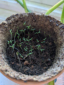

+++
title = "Gratitude (2021)"
date = "2021-12-12"
slug = "gratitude-2021"
draft = false
+++

This week's inDay theme was Gratitude and I've been thinking about that a bit. Last year I [posted about a bunch of things I was grateful for...but being ](/igotw/2020-12-11-gratitude/) grateful isn't the same as expressing gratitude. "I like hot dogs" isn't quite the same thing as expressly telling the inventor of the hot dog "I am grateful that you invented the hot dog", yeah?

_So I thought this year I might call out Carolyn Bloodspecifically._

cblood has made my life better for having her in it in a whole bunch of ways. I'm not going to dig into it here (I'll reach out to her on Slack), but let's take a peek at something recent:

This is conference swag. No, it's not a fucking t-shirt...it's a little LinkedIn-branded planter pot where I'm growing some poppies. (Err...I think they're poppies...lol I'm not a grower...)

It doesn't matter what the fuck they are... they're growing!

So. Thank you, _Carolyn Blood_, for being consistently awesome.
