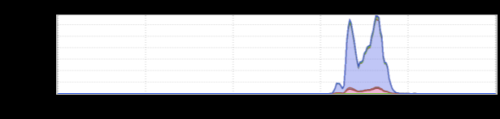
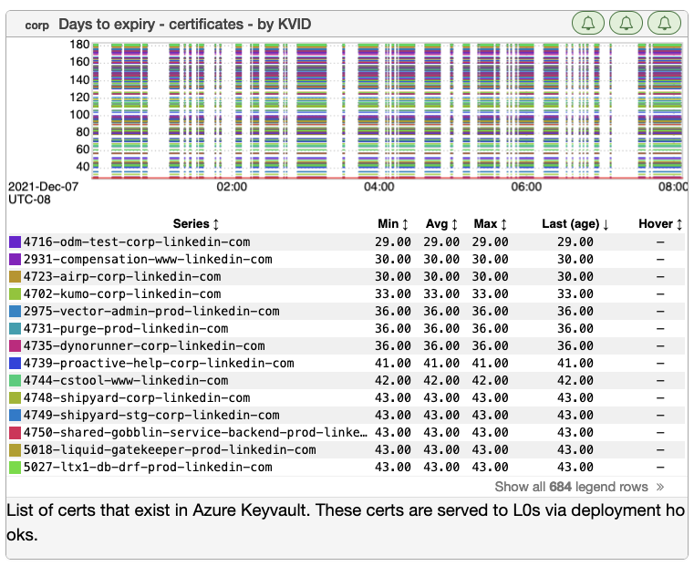
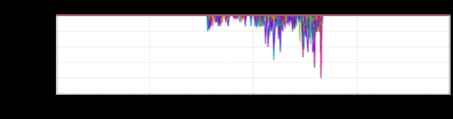

+++
title = "Unintentional Art (February 2022)"
date = "2022-02-03"
slug = "unintentional-art-february-2022"
draft = false
+++

I remember sitting in front of the TV the morning after a big snowfall watching the school closings scroll across the screen when I was a kid, hoping and praying for a Snow Day. Nowadays, the school district just calls everyone...and sends an SMS...and sends an email. Except it's not called a Snow Day any more; it's called - get this - a *Calamity Day*.

I have to admit it sounds way more badass than Snow Day.

Anywho, let's take a peek at a few bits 'n' bobs from my stash.

[I'm pretty sure this lil guy is from GCN-35784](https://jira01.corp.linkedin.com:8443/browse/GCN-35784), but it really makes me think of Frank from Donnie Darko:

Next up I've got a couple of nifty inGraphs that _Kenneth Lu_ sent my way. He entitled this one "Interstellar":

...and this one "Rainbow Bridge" or "Stairway to Heaven" (although when I look at this I see Missile Command):

_Last but not least, a submission from Vishnu C N_ entitled "When It Rains Log4J":

