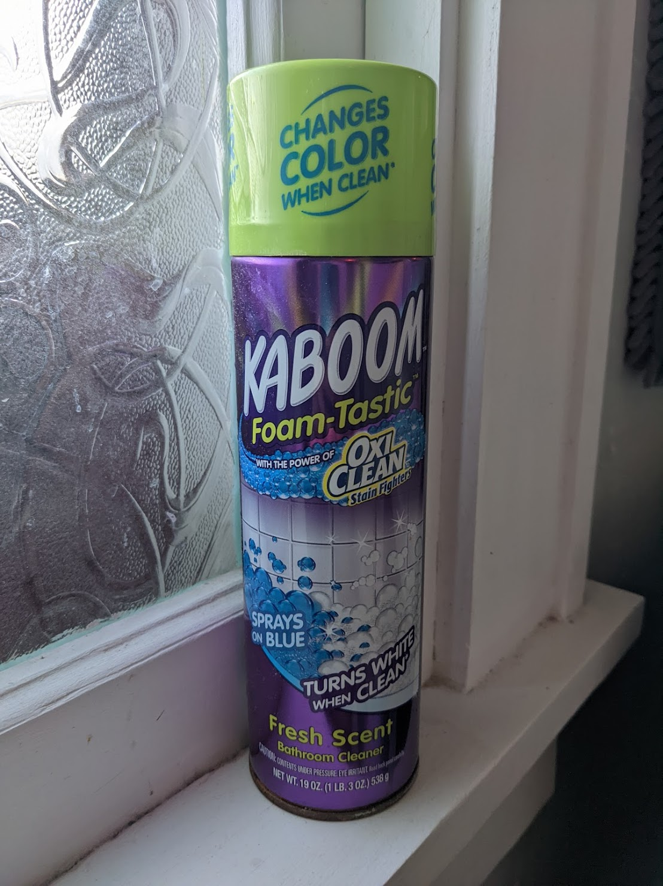

+++
title = "KABOOM"
date = "2022-02-11"
slug = "kaboom"
draft = false
+++

Who remembers the humble bathroom magazine caddy? Situated alongside the commode, it contained some few lightly-fondled periodicals issued some time in the past decade or so. In those halcyon ante-Zynga days one needn't wonder too hard about who touched the Sports Illustrated last or what they were doing - *one knew -* its dappled pages at least served as an alternative to re-learning the formula for Pantene Pro-V by rote.

What I want to know is: where was *this* before crushing candy became the go-to loo entertainment?

My God. If I were to form a startup whose mission was to make toxic chemical products as appealing as possible to small children, I'm not sure I could execute on strategy any better than this. The gaudy color scheme. The comic book font, all-caps, proclaiming a product name decidedly chockfull of excitement and alleging it to be "Foam-Tastic!" Not only does it make bubbles...*but they change color?!* Why not slap a Mattel logo and a picture of an action figure on there? (Looks like *someone* forgot about merchandising opportunity, mmm?)

I want to call Poison Control just looking at this thing. I mean, I'm a grown-ass man and  wanna play with it.*I*

Anyhow...be safe out there, folks.

...and happy Valentine's Day!
