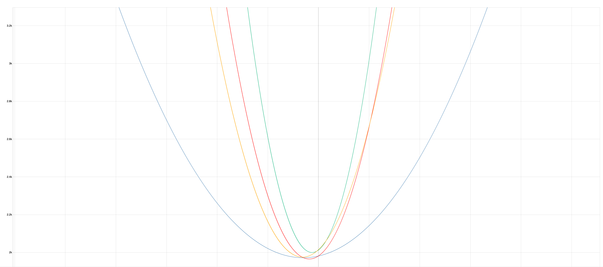

+++
title = "Creativity"
date = "2022-02-25"
slug = "creativity"
draft = false
+++

Some years ago I spent a little time exploring different representations of the relative ages of myself, my wife, and my kids. The “bubble chart” at the end of _this post was one of the results. I thought for Creativity inDay I might swing back around to the concept, this time representing our birth dates as quadratic _ functions of the form (month)x2 + (day)x + (year).

[Twenty-ish minutes fiddling around with Function Plot produced this:](https://mauriciopoppe.github.io/function-plot/)

According to Wikipedia [creativity is “a phenomenon whereby something new and valuable is formed.” Well…this is something “new” anyway, and I quite ](https://en.wikipedia.org/wiki/Creativity) like the effect. I’m the blue - nice and broad, by virtue of having an early January birthday. By contrast my oldest daughter was born in late August, producing a much “steeper” parabola. (My wife and my youngest have May and April birthdays, resp.)

Positive translation along the y-axis (the birth year constant) provides an unexpectedly melancholy reminder that on a long enough time scale the year in which you were born honestly doesn’t matter all that much. Backing out even further evokes a bittersweet story. These lines will never again converge…*but* as time marches onward the coefficients become trivial and drop away, revealing lines that march onward toward eternity, diverging but *very nearly* in parallel.

My wife, forever in between my two girls…and me, arms wrapped around the outside, in a kind of infinite family hug.

I suppose it’s all a matter of perspective.

Anyhow…Happy inDay, folks.
