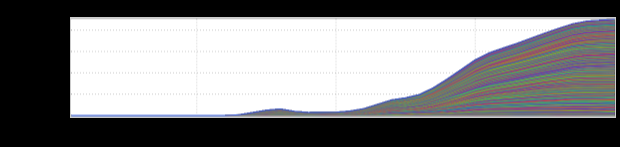
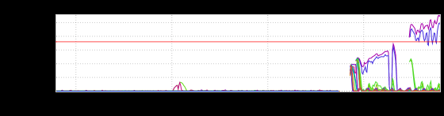
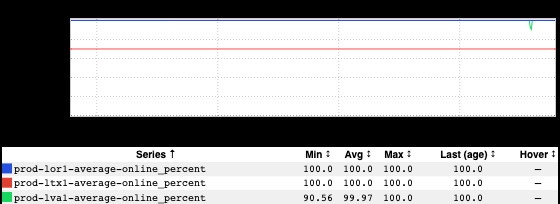
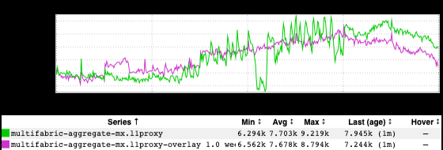

+++
title = "Unintentional Art (March 2022)"
date = "2022-03-10"
slug = "unintentional-art-march-2022"
draft = false
+++

TIL The lil Java mascot dude has a name: [Duke](https://www.oracle.com/java/duke/). ...and...well...this inGraph decidedly took a turn for the Duke:

Following that, this one that looks kind like the ass-end of a whale:

It leaves me wanting more, wondering what the front half of this feller looks like. And then there's this:

When I look at it I hear something like [*sproi-oi-oing!*](https://www.youtube.com/watch?v=t6KH5gwgAYE)

...and then there's this one, which is kinda boring but feels like it should be entitled "Get With the Program" or "You Had One Job" or suchlike:

I s'pose at least it never breached threshold.

...and finally, I give you Superbowl LVI:

_I've posted about the Superbowl many a time, and I don't have too much "new" to say about this one. As always, the halftime show appears to have been _ the most engaging part. I guess it's kind of interesting that Mexico gets this engaged with the Superbowl (I don't believe inGraphs for traffic from Mexico have been available in previous years, but I could be wrong about that).

Anyhow. Happy Thursday, folks. Be kind to one another out there.
