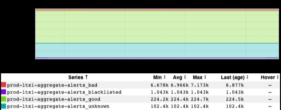

+++
title = "Questions"
date = "2022-03-19"
slug = "questions"
draft = false
+++

Frequently inGraphs are used to find answers - When did the Thing break? What does the latency look like? What's the current traffic distribution?

[But often they can also prompt questions. Take this beaut' ](https://ingraphs.prod.linkedin.com/dashboard/autoalerts-ng/graph/%5BSITE-1%5D%20(site%20prod-ltx1)%20Alert%20state?fabrics=prod-ltx1&filter=site-1.%2Balert%20state&use_time_selector&start_time=1647372180000&end_time=1647375780000)_Joe Gillotti  sent my way:_

What we're looking at here is the state of all autoalerts in prod-ltx1. ...and it makes me wonder...

There are something like 330K alerts in prod-ltx1. Assuming even distribution among prod fabrics that means upward of a million alerts for all of production. ...is that Too Many? I suppose that number is somewhat mitigated by the fact that alerts are the mechanism we typically use to drive _automation (for example, to trigger Nurse_ plans) - i.e., some percentage of these alerts never result in escalation to a human being - but even so... it seems like a lot, no? There are 102.4K alerts in "Unknown" state. At the risk of tautology: I don't know what that means. ...but on its face it seems like having roughly a third of all alerts in an "Unknown" state might be an "issue" we'd want to look into, doesn't it? (IIRC _Mon Infra_ is actually taking steps to try and tackle this at present.) There are 224K alerts in a "Good" state. It certainly seems desirable for the majority to be "Good", but also... There are ~7K "Bad" alerts, at steady state. This is another place where I'd wonder how many of those are being leveraged to tell *other* computers to perform some action. I also suspect there is some non-trivial percentage of these - whether used to trigger automation or not - that are [consistently "Bad", and perhaps have been so for a good long while. Maybe they've been suppressed, or perhaps they're just out there firing off ](/igotw/2017-05-04-not-even-wrong/) [emails into the void](/igotw/2017-05-04-not-even-wrong/) every so often.

I alluded to this above, but I guess for me the most critical bit of missing information here is the frequency with which a "Bad" alert requires human intervention. Perhaps I could approximate that with an inGraph of Iris phone calls (surely that exists somewhere - mebbe I'll try and track it down next next week). We might consider a dystopian worst case in which the entirety of the Eng org is assigned one alert per minute - in perpetuity - to *just* deal with the "Bad" alerts *in one production fabric.*

Hyperbolic? Certainly. And it's a good demonstration of the sort of "fatal flaw" of forming an opinion about the world based on a single metric.

...but I think maybe more automation isn't always a positive thing. When I look at an inGraph like this I have to wonder: have we made it *too* easy to automatically generate interrupts?
