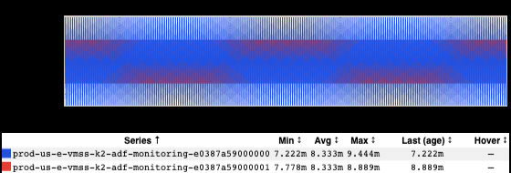
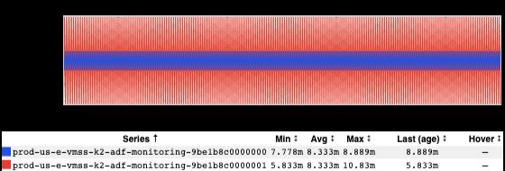

+++
title = "Moiré"
date = "2022-04-10"
slug = "moire"
draft = false
+++

Every now and again conditions will be just right for inGraphs to exhibit a sort of [moiré effect. Here are a couple of examples:](https://en.wikipedia.org/wiki/Moir%C3%A9_pattern)

It's interesting - and one might say lovely - but I have to admit that I don't quite grok how this actually happens.

Any ideas?
