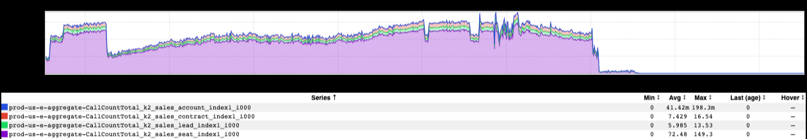
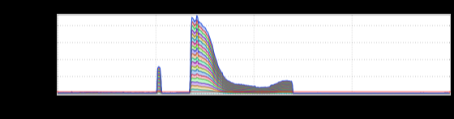
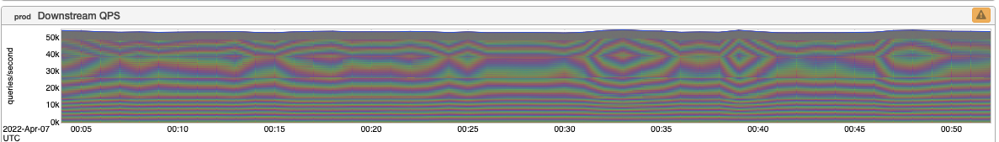
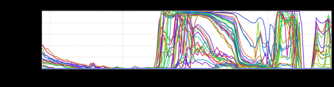

+++
title = "Unintentional Art (April 2022)"
date = "2022-04-15"
slug = "unintentional-art-april-2022"
draft = false
+++

This week I've just got a few bits 'n' bobs from my stash before I head off for DTO (yay, Spring Break!)

This first one reminds me of nothing so much as a [P-51 Mustang](https://en.wikipedia.org/wiki/North_American_P-51_Mustang), in profile. Also worth noting: this may be the first prod-us-e inGraph to appear in an igotw?

Next up is...hmmm...a sort of bookend? Or...perhaps Duder standing there at midnight on the 9th needs to get out of the way?

This next one popped into m'Slacks just a few days too late to make it into the _post on the Moiré effect_. (Where were you last week, _Andrew Guirguis?!)_

...and this one? Well. I guess I'd mebbe just call this one "Maximum Sadness".

Happy Good Friday, Happy Easter, and Happy Tax Day, y'all!
