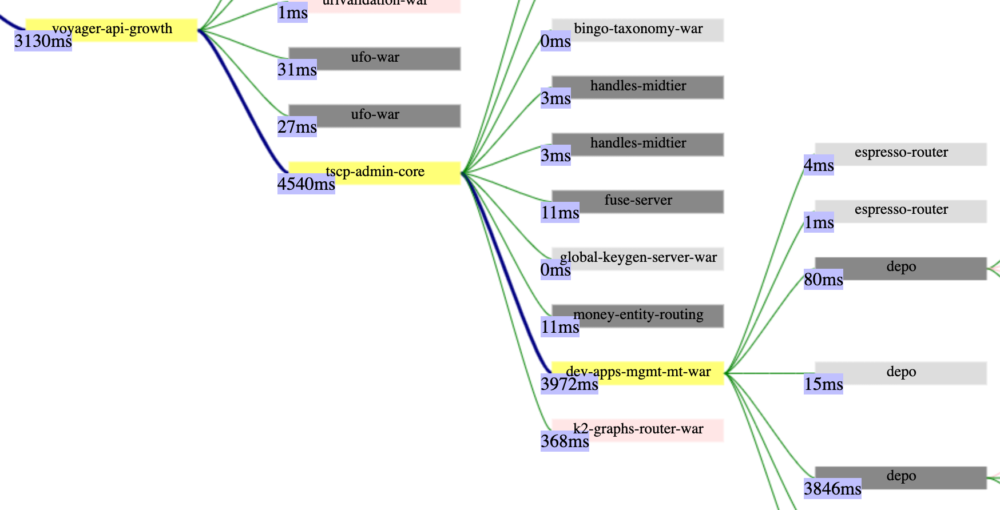
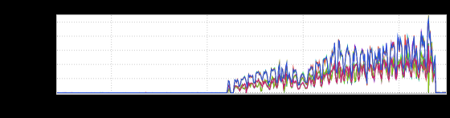
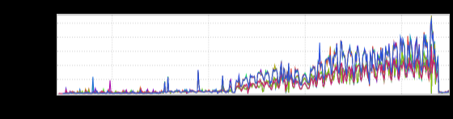

+++
title = "Calltree"
date = "2022-05-12"
slug = "calltree"
draft = false
+++

In all the years I've been posting these I don't recall ever having talked about _calltree_. Let's remedy that, shall we?

Feast your eyes on this badboy:

[This is a subset of a calltree for a thing that broke recently](https://jira01.corp.linkedin.com:8443/browse/DEVX-3440). The observant...err...observer will note the response times and see that for this particular calltree voyager-api-growth returned after 3130ms, while its immediate downstream (tscp-admin-core) returned after 4540ms. Smells like a timeout to me! (The associated logs verified that voyager-api-growth was timing out the call after 3000ms.) I suppose we could just increase that timeout (which we did, as a temporary mitigation), but what if we wanted to dig a little deeper?

One might also notice that it doesn't appear to be tscp-admin-core's "fault". It's calling dev-apps-mgmt-mt-war, which is itself calling depo; with a response time of 3846ms that would appear to be the "long pole". Let's take a closer look at that depo endpoint:

Huh. A more-or-less linear increase in latency over the course of ~6 months...that's probably not desirable behavior, now, is it?

I've cropped out the righthand side of this particular calltree, but I can assure you that it's utterly uninteresting - a handful of calls to espresso that returned in ~2ms or so. So, it would seem that our problem resides within depo (and not something downstream of it), right?

Well, a little further investigation revealed that the code for this particular endpoint made calls to an Oracle database. These calls don't show up in calltree due implementation details (because if it ain't rest.li then it must not be very important, amirite?) However, there's a latency inGraph for those calls:

Look familiar? As it turns out, these Oracle queries were doing a full table scan against an unindexed column. As that table gradually grew over the course of 6 months, so too did the query time.

Okay! So we've got our smoking gun *and* a potential path forward - just add an index to that column. Easy peasy, yeah?

Here's the kicker: the data from that query had originally been added for a use case that had since been deprecated (PAL, if you're curious). So. This query was artificially inflating the call time *and then effectively being discarded/not being consumed by any upstream caller.*

At any rate, all's well that ends well (as demonstrated by the latency graphs); the offending code was removed, and the call times dropped back down into a more reasonable range.
