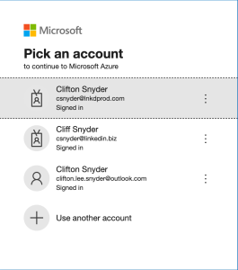
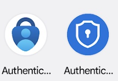

+++
title = "MFA"
date = "2022-05-19"
slug = "mfa"
draft = false
+++

Once upon a time, I had a Symantec VIP token on my phone. After wrecking a couple of phones (turns out I'm decidedly hard on mobile devices) and going through the pain of getting a new phone re-registered, I requested a hard token. It’s a little keyfob I carry around on my keychain. I always have my keys with me, so for a little while this was a pretty acceptable state of affairs.

Somewhere along the way yubikeys became a Thing. Y’know, for the kinds of things that the Symantec token…wasn’t “good enough” for, I guess? (Side note: The yubikey can supposedly provide a 6-digit Symantec code, as well, but I’ve never been able to reliably fiddle the USB nubbin for exactly the right amount of time to get “long-press” to work.) So be it. Now I've got a little doodad that just stays sticking out of my MBP at all times, and a new bit of software (yubiswitch) for turning it on/off with a keyboard shortcut so it doesn’t spray gibberish every time I breath on the damn thing. I suppose it’s unobtrusive enough and, again, always with me where I need it.

Then along comes Microsoft. They’ve got their own auth requirements, natch, so I get another MFA app on my phone. But now I’ve also got different “kinds” of auth to worry about. Take a look at this:

Okay. So, what link did I click on that led me to this choice in this particular tab? And which identity does it require for me to log into it? i.e., Is it “.biz or ‘prod’?”

Not only do .biz/prod identities have different passwords, but they have different MFA flows. Sometimes I get a push notification to approve the access. Sometimes that doesn’t work and I have to put in a code from the app. Sometimes the thing I’m trying to log into gives me a 2-digit code, and I have to go to the app and put in the 2-digit code to approve the access. Swell.

As a super-awesome “bonus”, I happen to play World of Warcraft and Blizzard/battle.net has their own MFA app. Which is also called just “Authenticator". Which is also blue. Which also looks like a shield/lock. Observe:

You tell me which “Authentic…” to tap at a glance, eh?

So. I've got the fob. I've got the yubi. I've got the app (whose icon looks almost exactly like another app), and within the app there are multiple flows depending on which identity I picked (iff I picked the right one, otherwise it won't work).

Oh! Almost forgot about all of the things that send me a code via SMS! Or maybe they email me! I've got those, too.

So...I guess I'm covered?

I'm Secure?

MF, indeed.
