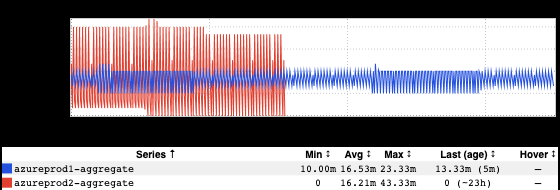
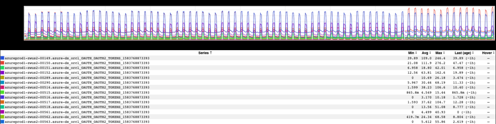
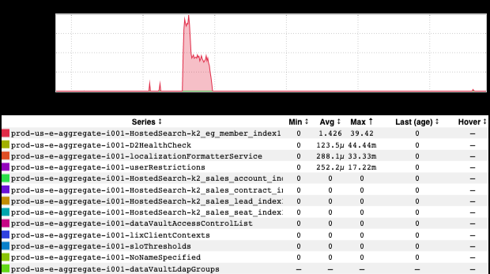
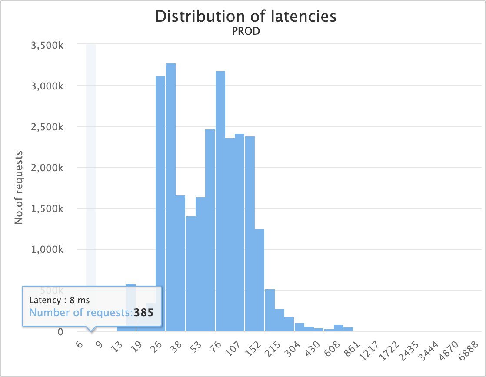
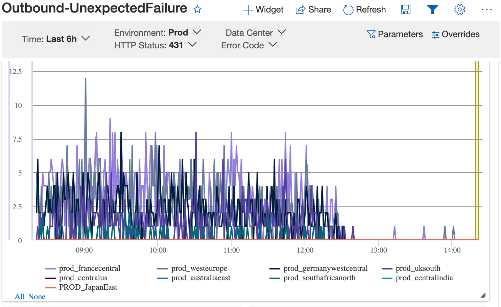

+++
title = "Unintentional Art (June 2022)"
date = "2022-06-03"
slug = "unintentional-art-june-2022"
draft = false
+++

It's that time of year again - the kids are out of school, the pools are open, the grills are lit, the flip-flops are flippin' and floppin'. Ah, Summer.

Let's take a look at a few bits 'n' bobs from my stash.

First up is one I like just due to its overall energy:

...and another, for its regularity (while having enough variation to not become monotonous):

Summer break is likely to mean baseball games...and this lil guy reminded me of nothing so much as a foam finger:

We're Number One! ...and, in a similar vein, a sort of stylized "Vulcan salute":

This last one I picked both because I don't think I've shown this brand of graph here, *and* because it may be instructive:

It comes from Microsoft's Geneva monitoring platform, and it depicts 431 "Request Header Fields Too Large" response codes being returned to the client. In this particular case, some percentage of requests were being sent with 8193 bytes of header data, and the jetty limit for request headers was set to...8192 bytes, which looked like this in our logs:

2022/05/09 19:46:40.425 WARN [org.eclipse.jetty.http.HttpParser] Header is too large 8193>8192

If you're seeing this, the fix (or rather,  [ fix - there are probably other ways to skin this cat) is to simply ](https://rb.corp.linkedin.com/r/3361949/)*a*[bump up the limit.](https://rb.corp.linkedin.com/r/3361949/)
