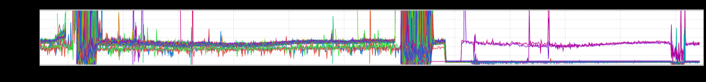
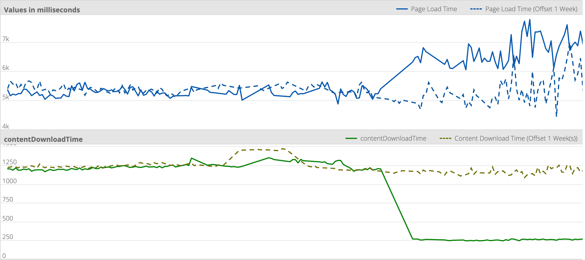

+++
title = "Tradeoffs"
date = "2022-06-10"
slug = "tradeoffs"
draft = false
+++

[voyager-web serves what LinkedIn has historically dubbed "Homepage" - i.e., The Site. It fell over a coupla times this week (see: GCN-37000 ](https://jira01.corp.linkedin.com:8443/browse/GCN-37000)[GCN-37014, ](https://jira01.corp.linkedin.com:8443/browse/GCN-37014)) and I thought it might be interesting to talk about the technique for mitigation used while investigating root cause. Check this out:

I've set an upper bound on this inGraph so that the latency spikes don't completely blow out the scale and make it inscrutable. The incidents are visible as the perturbations on Monday morning, and then again on Tuesday morning. (Side note: I spent about a half hour on Wednesday morning refreshing this inGraph with bated breath.) After the second incident, a change was made and latency went down pretty significantly - by 800ms, something like an 80% improvement. Whoa! Big win, right? (The astute observer might also notice a couple of nodes whose latency remains high - these were left unchanged for testing purposes.)

...well, as it turns out, while server-side latency went down, page load times actually went *up*. On its face this might be a little counterintuitive, and takes a bit of understanding how voyager-web works.

_voyager-web has a Base Page Renderer_ (BPR), which is pretty much exactly what it sounds like. BPR has 3 different rendering modes:

**Vanilla** - BPR delivers a barebones/skeleton page that is then rendered/populated with data from subsequent API calls from the browser **Server Side Rendering (SSR)** - BPR delivers a page that has been completely pre-rendered for initial viewing by BPR **BigPipe** - BPR delivers a barebones/skeleton page (as in Vanilla) *and* streams the initial API responses needed to render the page

The change that was made after the second GCN was to revert BPR to Vanilla mode, with the (correct) intuition that the problem (a memory leak) had something to do with rendering. This naturally decreased the time it took to deliver the page...at the expense of client browsers now having to wait on round-trip API calls and performing their own rendering.

...and so:

I really love this pair of graphs, as they pretty distinctly show the content download time (bottom graph) dropping off precipitously while the page load time (top graph) goes up.

*Many thanks to Anoop for his super-detailed email updates over the course of these incidents, and to* *Stufflebear for helping me to better grok BPR.*
