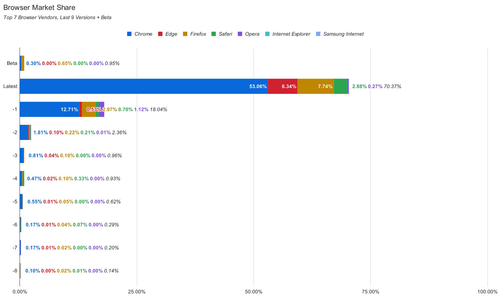

+++
title = "Diminishing Returns"
date = "2022-06-18"
slug = "diminishing-returns"
draft = false
+++

_Chris Carinirecently sent me _[this blog post covering how Github thinks about browser support. It's particularly timely, given this week's ](https://github.blog/2022-06-10-how-we-think-about-browsers/)[retirement of ](https://www.upworthy.com/goodbye-to-internet-explorer) [Internet Explorer](https://www.upworthy.com/goodbye-to-internet-explorer). Chris sent it along because it has a handful of "pretty colorful graphs", but perhaps the one that's most striking to me is this one:

Yes, this is a PNG screenshot of the original - it would appear that Confluence doesn't support SVG as an image type. Neat.

Anyhow...nearly 90% of the traffic from these browsers is either the latest or the -1 version, with a precipitous falloff after that. As an engineer - decidedly not a UX engineer, but one who groks deeply the pain of having to support older/legacy versions of things generally - this makes me happy.

Happy Father's Day, folks, and Happy Juneteenth!
