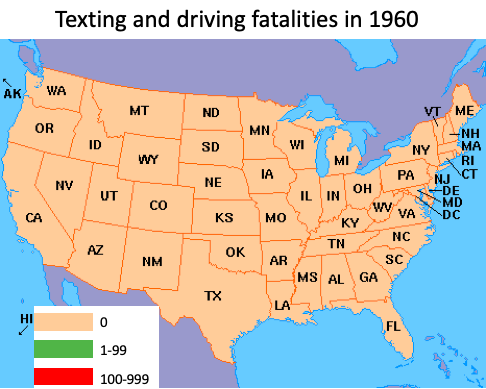
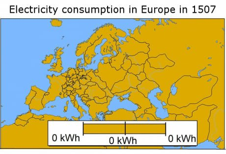
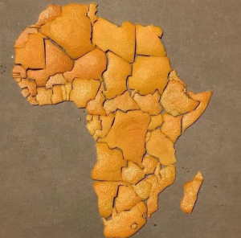
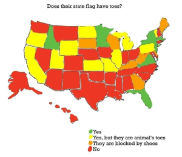
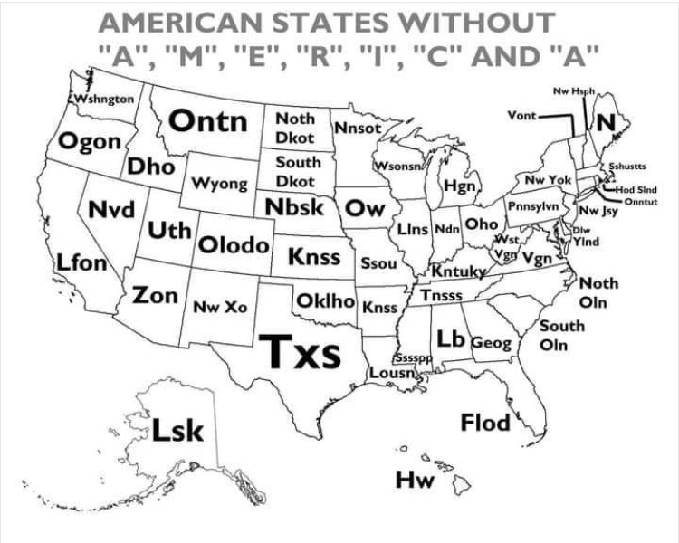

+++
title = "Cartography Redux"
date = "2022-07-29"
slug = "cartography-redux"
draft = false
+++

[Terrible Maps is the brand of thing that sort of exists on the fringes of my awareness and then seems to pop into visibility every so often. It's been a little ](https://twitter.com/TerribleMaps) while since it [last resurfaced for me, so I thought I'd peruse what New Hotness they might have to offer.](/igotw/2020-05-01-cartography/)

This time around I started to note a few general themes. For instance, maps that are "all one color"; e.g.,

Another is "maps made out of food", like this map of Africa made out of orange peel:

Probably the primary category is "Silly Maps", which is where I think it really shines - like this map of "state flags that feature toes":

...or this map of United States state names with the letters in "America" removed:

Vont, indeed. And - every now and again - there's one that's actually beautiful, informative, and/or just generally impressive:

Love it.
