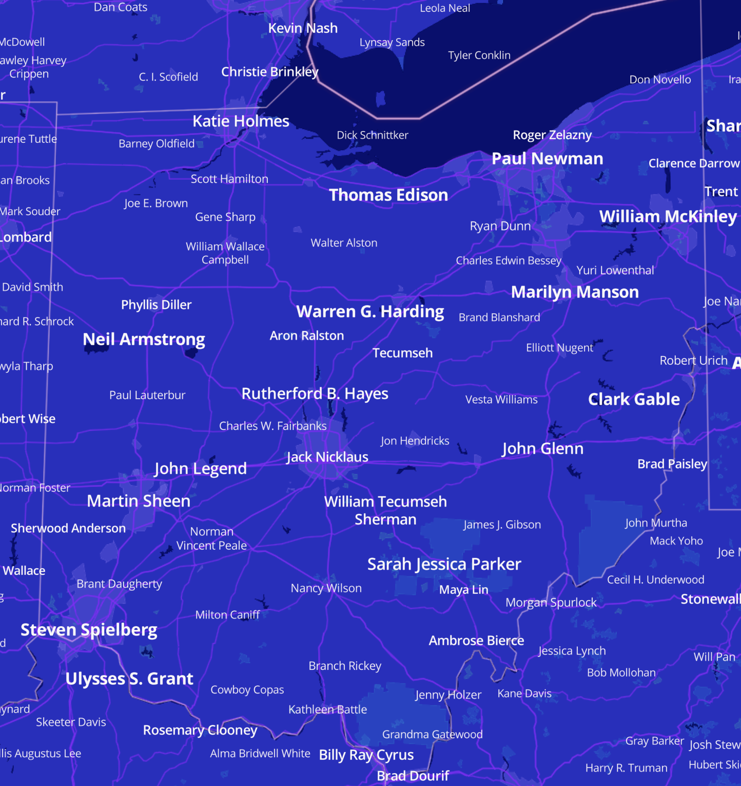

+++
title = "Moar Maps"
date = "2022-08-05"
slug = "moar-maps"
draft = false
+++

_I know I just did a post about maps last week_...but *this* [week I came across this wonderful world map of notable people throughout history. I'm a little ](https://boingboing.net/2022/08/04/this-world-map-shows-the-most-notable-person-in-every-town-from-3500bc-2018ad.html) [embarrassed to admit how long I've spent panning around and zooming in/out on this lil guy. Of course, one of the first things I wanted to know: who are](https://tjukanovt.github.io/notable-people) /were the most famous people from my home state of Ohio.

Presidents out the ass, astronauts, a coupla-few actors/entertainers whose names you might recognize...not bad, Ohio. Not bad.

As for Columbus itself it more or less boils down to a professional golfer...but given that he's the GOAT I s'pose I'll take it.
