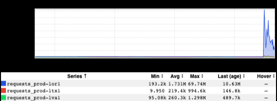
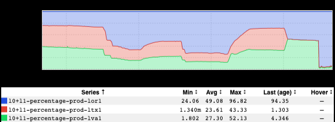

+++
title = "Before You Panic (Trust, but Verify)"
date = "2022-09-02"
slug = "before-you-panic-trust-but-verify"
draft = false
+++

Earlier this week my [xbar caught my attention:](https://linkedin.ghe.com/multiproduct/li-xbar)

21M QPS, eh? Is [Conan](https://www.youtube.com/watch?v=cinb5tcRYXw)_ messing with us again? (For context: we only just recently crossed the 1M QPS mark.) Time to take a peek at go/stickyrouting_:

Okay, so we actually peaked around 70M? With the vast majority being in prod-lor1 (I love the distribution graph):

[If I wasn't suspicious before, now I most certainly was. By this time there was some chatter in #noc - "Are we under a DDoS attack?" - and this isn't an ](https://linkedin-randd.slack.com/archives/C08856Q9H) unreasonable question to ask, but these kinds of numbers are too unbelievable for me to...err...well, to believe them. My expectation is that this amount of traffic would completely melt the site. If we were under a "successful" DDoS of this magnitude, what I would expect to see is a sharp spike in requests followed by an equally-precipitous drop to zero (or near it) as everything saturated, subsequently crashed, and came grinding to a halt.

[So I poked around some of the frontend services' and ATS inGraphs, which had remained unperturbed. By this time a GCN](https://jira01.corp.linkedin.com:8443/browse/GCN-37457) had been spun up, the problem (metrics mis-reporting) was understood, and a solution was being worked on. This is still a problem - we need these metrics to be accurate - but my site wasn't in imminent danger of imploding so I went on about my business.

All's well that ends well.

[*Note: If you hadn't heard of it before, xbar*](https://xbarapp.com/) *is a nifty little tool that can stuff interesting bits of information into your MacOS menu bar. We have a handful of* [*Li*](https://linkedin.ghe.com/multiproduct/li-xbar) [*nkedIn-specific plugins for it, like the site traffic screenshot I shared above. Check it out!*](https://linkedin.ghe.com/multiproduct/li-xbar)
