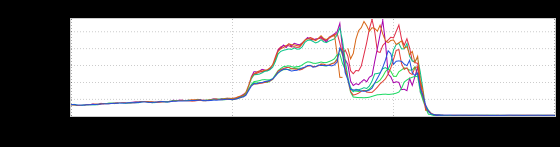
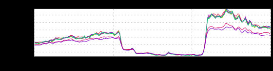
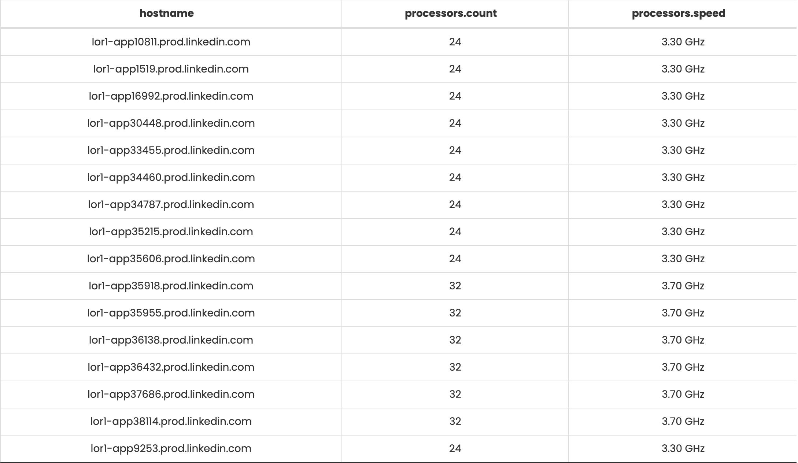

+++
title = "inQuery"
date = "2022-09-22"
slug = "inquery"
draft = false
+++

A [recent GCN](https://jira01.corp.linkedin.com:8443/browse/GCN-37556)[ (no, not that one](https://jira01.corp.linkedin.com:8443/browse/GCN-37569)) got me poking around at inGraphs trying to satisfy my curiosity. While I was doing so I stumbled across this:

This is an inGraph of ProcessCPUTime, which according to [the docs](https://docs.oracle.com/javase/7/docs/jre/api/management/extension/com/sun/management/OperatingSystemMXBean.html) is "the CPU time used by the process on which the Java virtual machine is running in nanoseconds." Leaving aside the bit where it gets all wibbly-wobbly (that would be the GCN) notice how those lines are nice and tight up until just after 07: 00, when they diverge. Another look at this phenomenon in a different fabric:

So under "low" load the amount of CPU time each process gets is pretty much the same, but as load increases/goes past a certain threshold some processes get more CPU time than others. Interesting.

My theory for this was that perhaps the respective machines on which these services are running have different CPUs; under load, perhaps a service running on a "faster" processor gets more CPU time as compared to a service running on a "slower" processor. So...how to go about vetting this out? I don't have access to the machines (I don't own this service), so inspecting /proc/cpuinfo directly is a no-go. Hmmm...

I asked around a bit and _Jamie Henderson__ put me on the right path: inQuery. After fumbling with the interface a bit I came up with this query:_

inquery facts --range "%prod-lor1.accessTokens-midtier.1" --fact-list "processors.count,processors.speed"

Which produced the following result:

...and there you have it - some of the nodes have more processors with a faster clock speed.

Satisfied that I'd proved out my theory, my curiosity turned to the query itself. It's got the look-and-feel of a CLI, yeah? So I dropped it into my terminal and, lo and behold!

{ "data": [ { "hostname": "lor1-app10811.prod.linkedin.com", "processors.count": 24, "processors.speed": "3.30 GHz" }, { "hostname": "lor1-app1519.prod.linkedin.com", "processors.speed": "3.30 GHz", "processors.count": 24 }, { "hostname": "lor1-app16992.prod.linkedin.com", "processors.count": 24, "processors.speed": "3.30 GHz" }, { "hostname": "lor1-app30448.prod.linkedin.com", "processors.count": 24, "processors.speed": "3.30 GHz" }, { "hostname": "lor1-app33455.prod.linkedin.com", "processors.count": 24, "processors.speed": "3.30 GHz" }, { "hostname": "lor1-app34460.prod.linkedin.com", "processors.count": 24, "processors.speed": "3.30 GHz" }, { "hostname": "lor1-app34787.prod.linkedin.com", "processors.speed": "3.30 GHz", "processors.count": 24 }, { "hostname": "lor1-app35215.prod.linkedin.com", "processors.count": 24, "processors.speed": "3.30 GHz" }, { "hostname": "lor1-app35606.prod.linkedin.com", "processors.count": 24, "processors.speed": "3.30 GHz" }, { "hostname": "lor1-app35918.prod.linkedin.com", "processors.count": 32, "processors.speed": "3.70 GHz" } ], "total": 16, "offset": 0, "limit": 10, "elapsed_time": 93.9946 }

Neat!
