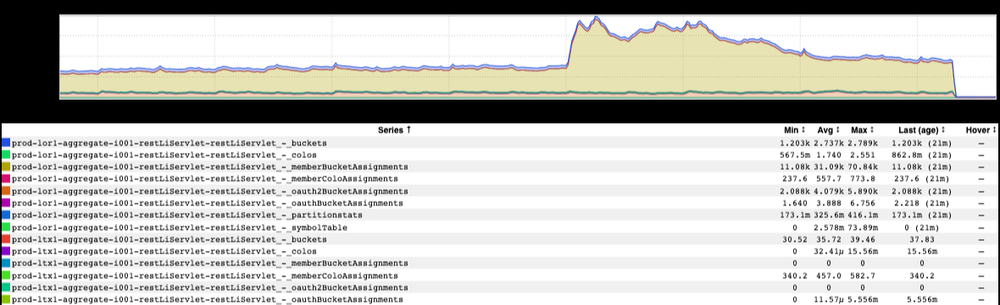
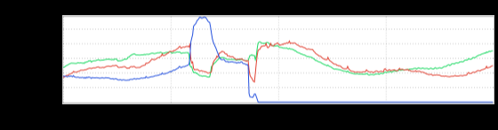
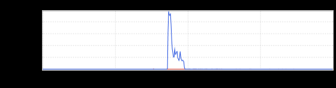

+++
title = "Oreg-O-No!"
date = "2022-09-30"
slug = "oreg-o-no"
draft = false
+++

Last week [a bit of a Thing](https://jira01.corp.linkedin.com:8443/browse/GCN-37569) happened - a "power event" in our Oregon data center whereby we lost an entire suite of machines, all at once. What did that look like?

Well...

This was taken during the incident itself, so it isn't (exactly) accurate. What I mean: various pieces of the stack that collect the metrics were busted at the time, so the very metrics themselves were unreliable at the time. ...but it certainly paints a reasonable picture of what was going on in broad strokes.

Picking a frontend at random after-the-fact shows something like this:

Yep, that's a big ol' QPS dropoff. Oh, and in terms of errors (or, more specifically, 5XX responses):

"We're Number One!"

Happy Friday, folks.
