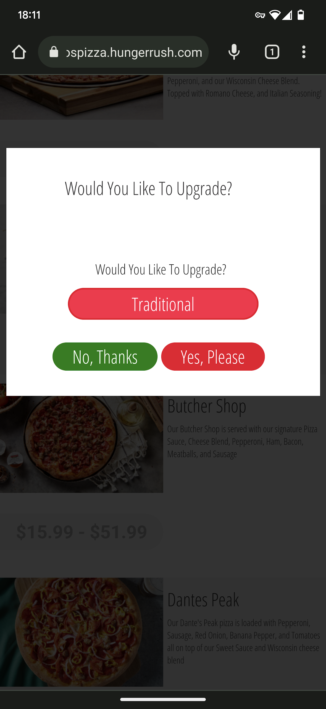
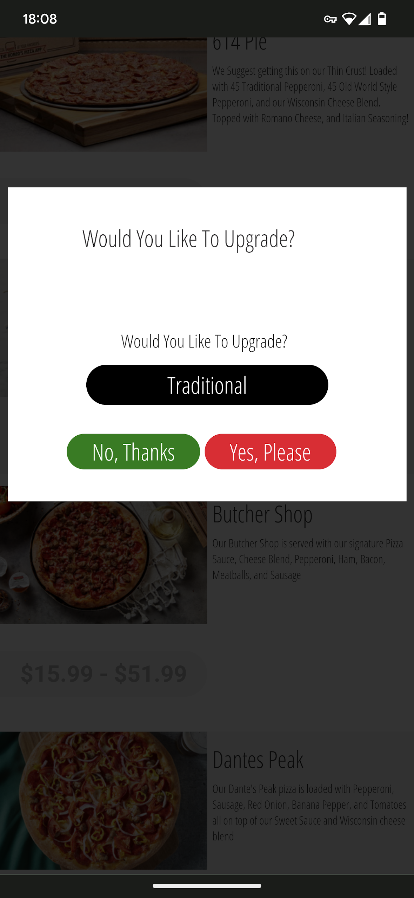

+++
title = "Pizza"
date = "2022-10-27"
slug = "pizza"
draft = false
+++

Last week I ordered a pizza. I want to talk through my experience, as a sort of expressive therapy.

I pulled up the pizza place's mobile web site and flicked through the menu. It wasn't easy to navigate (see: below) but I sorted it. One large Supreme. Coolcoolcool. I tapped in my credit card and hit "Order".

...and then.

"Upgrade", huh. On its face that sounds cool. ...but...well...what am I "upgrading"  ?*to*

If it had said like "we'll make it 10% moar biggerer" or "we'll put s'more shit on it" then that might've been compelling...but the screen just says "Traditional". The only place I've seen "Traditional" as a term is with respect to the crust. I'd already picked a crust, so...is changing from one crust selection to another really an "Upgrade"? Or is this just asking me whether I want to change my life decisions regarding pizza crust?

Also: on this screen it looks like "Traditional" is a button. So...what happens if I tap it?

Mistake. Now I'm spiraling. I can toggle the "upgrade" to "Traditional" between either Red or Black? What does it *mean*?

I decided to Phone-a-Friend. His suggestion: "Order *two* pizzas - one with either option - and see what happens!"

<sigh> But...I also have to pick Yes or No, right? (Sidebar: The text is fine and the buttons are positioned in the expected places, but...why is "No, Thanks" green and "Yes, Please" red?)

So...I actually have to order *four* pizzas to satisfy each state of the problem space, right? No/Traditional=Red, No/Traditional=Black, Yes/Traditional=Red, Yes/Traditional=Black

At this point I considered just bailing and calling to place my order.

LOL Just kidding - it's 2022 nobody calls to order pizza any more, are you kidding me?

I suppose all's well that ends well; the UX might be a hellscape, but ultimately I picked whatever I picked and some 20 minutes later I had a pizza.
