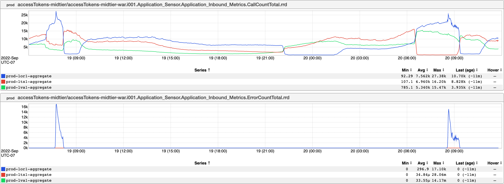

+++
title = "Double Jeopardy"
date = "2022-11-04"
slug = "double-jeopardy"
draft = false
+++

When I came across [this video](https://boingboing.net/2022/10/15/man-knocked-over-by-same-runaway-tire-twice.html) of a person getting hit twice by the same stray tire, I have to admit that my first reaction was to laugh. It's not that I'm some unsympathetic monster - that's a human being who probably got hurt, and I suspect everyone has had "days like that" - it's just the damnable unfairness of the thing.

My *second* reaction was "I wonder if I have an inGraph like this." Turns out, I do:

[Perhaps see also.](/igotw/2016-01-07-not-learning-from-mistakes/)

Keep your eyes peeled, folks. There are tires out there.
