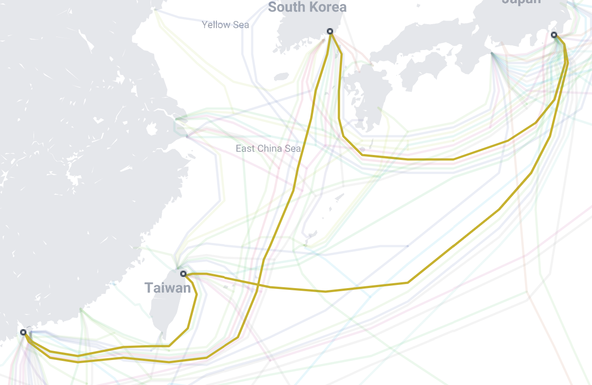

+++
title = "Submarine Cables"
date = "2022-11-18"
slug = "submarine-cables"
draft = false
+++

[I recently came across this submarine cable map. It's zoomable, pannable, searchable, and at time of writing tracks "](https://www.submarinecablemap.com/)530 active and planned submarine cables" (according to the [FAQ).](https://www2.telegeography.com/submarine-cable-faqs-frequently-asked-questions)

So I started fiddling with it. In particular, it lets you search by year ready for service all the way back to 1989...so you can kind of browse through different years and see when cables between various parts of the world were lit up. Wonderful.

Then I started to think about a post I wrote years ago about _The Good Ship Lodbrog. Perhaps I could find the specific cable that was cut?_

[Yep. Sure can.](https://www.submarinecablemap.com/submarine-cable/flag-north-asia-loopreach-north-asia-loop)

This is the FLAG North Asia Loop/REACH North Asia Loop, a 9,504km submarine cable which became ready for service in June 2001. It is co-owned by Global Cloud Xchange, PCCW, and Telstra, and has landing points in China, Japan, South Korea, and Taiwan.

How about that?
