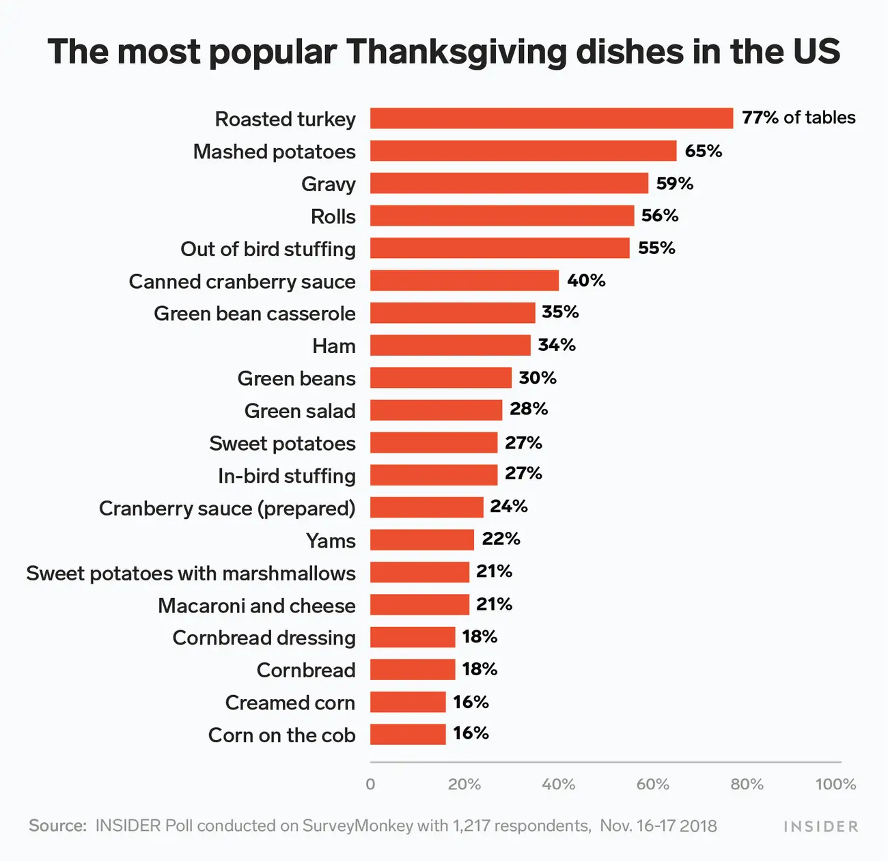
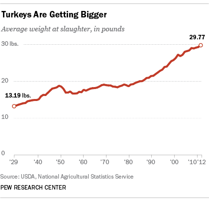
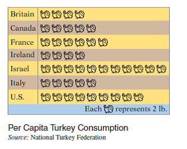
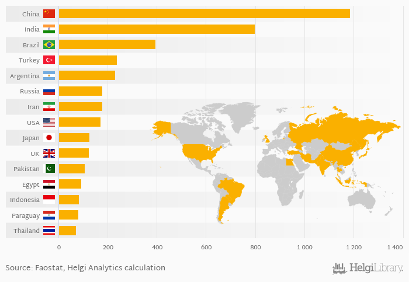
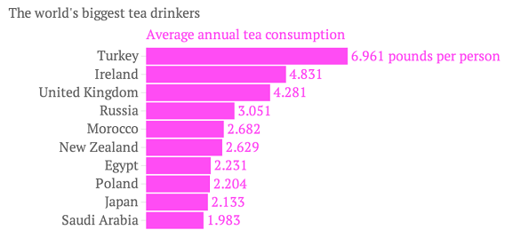

+++
title = "Gobble Gobble!"
date = "2022-11-23"
slug = "gobble-gobble"
draft = false
+++

Thanksgiving is tomorrow, so I thought I'd (1) get the igotw out a day early, and (2) make it about turkeys! I gave "graphs about turkeys" a quick Goog and picked out a few choice tidbits.

[From a survey about the most ](https://www.insider.com/most-popular-thanksgiving-dishes-america-us-2018-11)popular *common*  Thanksgiving dishes:

Perhaps unsurprisingly turkey tops the list, closely followed by mashed potatoes and gravy. ...although I do wonder about the 6% of people who selected mashed potatoes and did *not* select gravy. Maybe they assumed that gravy was implied when they picked mashed potatoes? Or is that 6% out there eating their mashed potatoes dry? Yeesh.

[How big are these turkeys? Well, they're getting bigger](https://www.pewresearch.org/fact-tank/2013/11/27/5-facts-about-turkeys/):

Hoo boy - 29 pounds? That's a big bird. (Side note: The [heaviest bird in the world](https://birda.org/what-is-the-heaviest-bird-in-the-world/) is the common ostrich, which can weigh over 300 pounds.)

Who's eating all this turkey? Well, as it turns out, Israel consumes the most turkey per capita:

I almost didn't post this bit of [chartjunk](/igotw/2019-05-09-chartjunk/), but I think it's an interesting statistic and I couldn't find a better-looking graph. In fact, evidence suggests that it's actually impossible to chart this data without making the chart completely goofy. See:

:eyeroll: Oh, brother.

Moving on, it may come as no surprise that China leads the world in [tea consumption](https://www.helgilibrary.com/charts/which-country-drinks-the-most-tea/):

[After all, tea is one of the world's most popular beverages](http://www.haleysdailyblog.com/9-most-consumed-beverages-around-the-world/)[ and China is one of the world's most populous countries. ...but what if we took a look at ](https://www.theatlantic.com/international/archive/2014/01/map-the-countries-that-drink-the-most-tea/283231/)[*per* ](https://www.theatlantic.com/international/archive/2014/01/map-the-countries-that-drink-the-most-tea/283231/) [*capita*](https://www.theatlantic.com/international/archive/2014/01/map-the-countries-that-drink-the-most-tea/283231/)[ tea consumption?](https://www.theatlantic.com/international/archive/2014/01/map-the-countries-that-drink-the-most-tea/283231/)

Turkey! Neat.

Happy Thanksgiving, folks!
