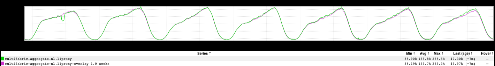
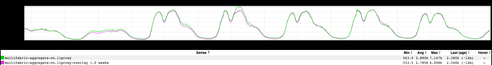

+++
title = "The Netherlands"
date = "2022-12-02"
slug = "the-netherlands"
draft = false
+++

I was poking around traffic inGraphs looking for World Cup impact when something interesting caught my eye. Check this out:

I'm a little surprised at the overall QPS - who knew we took so much traffic from the Netherlands? - but, more than that: the monotony! I see no meal times, only slight variability on weekends, and super-regular points of inflection at 09:00 and 21:00 (Central European Time). Folks, this is Not Normal. For comparison, let's take a peek at France:

This is *much* more like what I'd expect to see. Weekend traffic drops to something like half of weekday levels, with regular obvious dips around lunch and dinner time through the week.

Or China:

Similar weekend pattern, and the Chinese definitely take meals...they just don't come back to the site after dinner, apparently. Fair.

All 3 countries appear to sleep...but either the Dutch are fuckin' machines, *or* there are *actual* machines at play here. Perhaps some Netherlandish automation that skews the data toward this smoothness?

Fascinating.
