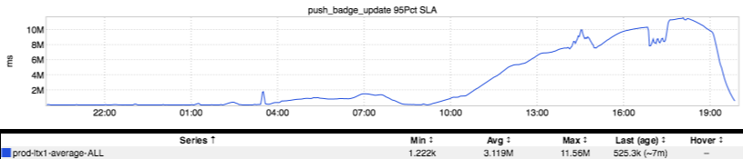
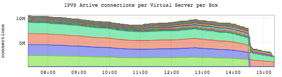

+++
title = "Unintentional Art (Random Edition)"
date = "2022-12-15"
slug = "unintentional-art-random-edition"
draft = false
+++

I was poking around my stash of graphs today looking for a little inspiration when it struck me that I could just do this:

ls | sort --random-sort | tail -5 | xargs open

After fiddling around trying to get xargs to do proper quoting/escaping (some of the filenames have spaces in them) I said "fukkit" and just opened the 5 files manually (because, [this](https://xkcd.com/1205/)).

Anyhow, this is what the "random sort" came up with:

**canary-fail.png**

This one has actually [appeared here before](/igotw/2016-05-26-troubled-canary/)[, and is one of several examples given in igotw of "carbon monoxide poisoning", so to speak. (Carbon ](https://en.wikipedia.org/wiki/Sentinel_species#Canaries) Monoxide would've been a way better title for that post, BTW...)

**restli-gateway_restli-gateway-war_i001_ExtAPI_ExtAPI-POST-networkSizes_OutstandingCount_rrd.png**

_This one was also previously published in a much more recent post about resource leaks_ (almost exactly one year ago).

**userp-has-a-sad.png**

[Three for three](/igotw/2017-01-19-a-cautionary-tale/)! (And it wins the prize for Best-Named inGraph Snapshot.) This one was *sort of* also about resources leaks...but really was more about what a former colleague would've referred to as "ten pounds of shit in a five-pound sack".

**push_badge_update 95Pct SLA (1).png**

Ah, so we've *finally* stumbled upon one that was *not* posted here. That said, I'm 99% certain it was related to _this l'il guy_.

**IPVS Active connections per Virtual Server per Box.png**

...and finally, this one appeared in a _previous UA post_ (which is incidentally probably my favorite UA post of All Time).
