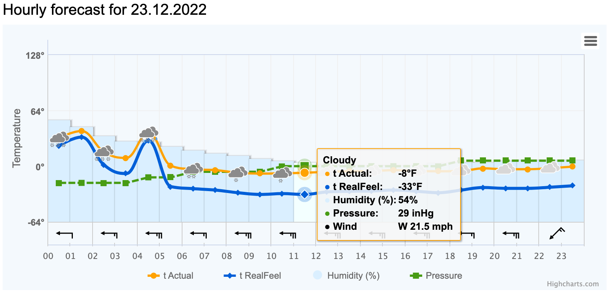

+++
title = "Frozen III"
date = "2022-12-29"
slug = "frozen-iii"
draft = false
+++

I'm not sure what the weather is like where y'all are at, but last Friday here was a bit of a doozy:

[...and, because this is igotw, here it is in graph form (courtesy of World Weather](https://world-weather.info/forecast/usa/columbus_1/23-december/#2022)):

Hoo boy.

I'm not 100% sure how "RealFeel" is computed - some combination of windchill and humidity and other factors, I suppose - but what I *can* tell you is about the time that number hits thirty below the RealFeel should *probably* just say "get your ass inside a tauntaun and wait it out."

Anyhow. Happy Holidays, folks. Stay warm out there!
