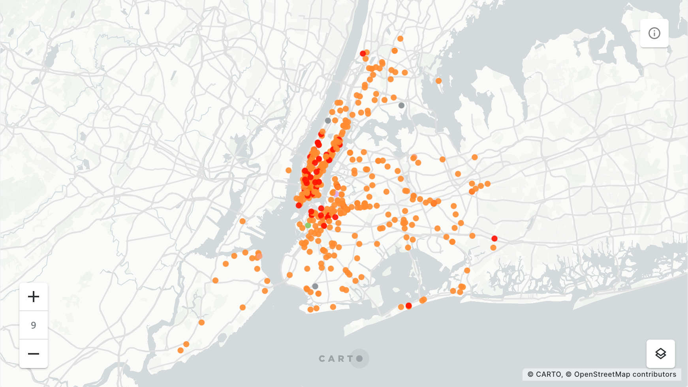

+++
title = "Slices"
date = "2023-01-13"
slug = "slices"
draft = false
+++

[No, not that kind ](https://crt.prod.linkedin.com/api/v1/docin/files/rain-cli/6.2.43/DEFAULT/pages/userguide.html#application-slices)[this kind](https://en.wikipedia.org/wiki/Pizza)[...](https://crt.prod.linkedin.com/api/v1/docin/files/rain-cli/6.2.43/DEFAULT/pages/userguide.html#application-slices)[!](https://en.wikipedia.org/wiki/Pizza)

Since 2014 Liam Quigley has meticulously documented every slice of pizza he's eaten (and posted them on [his insta). A few days ago he ](https://www.instagram.com/nycslice/)[published the ](https://elkue.com/nyc-slice/) [data, including a map of the locations, purchase date and price, etc.](https://elkue.com/nyc-slice/)

[The page links to a Google doc used to create the map, or if you want to grep it you can grab ](https://docs.google.com/spreadsheets/d/1EY3oi9ttxybG0A0Obtwey6BFu7QLqdHe02JApijgztg/edit?usp=sharing)[the CSV](https://datawrapper.dwcdn.net/kwc7V/4/dataset.csv) the feeds the price table. The latter may *also* bring a little joy to your Friday by virtue of the fact that it necessitates creating a little file named **pizza.py** for playing around with the data.

But I digress.

The fact that he's eaten 464 slices of pizza over the past 8 years - a little over a slice a week - didn't exactly floor me; if I lived in NYC I could pretty easily imagine myself meeting/exceeding that pace. But what *is* interesting is that his dataset includes 400 *unique* pizza places. The vast majority he only visited once, and there are only a handful of places he visited more than 3 times. Those are:

Gotham Pizza Joe's Pizza Little Italy Pizza Margherita Pizza Inc

Hey, neat! I've been to Joe's. 10/10 would recommend.
