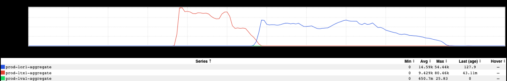
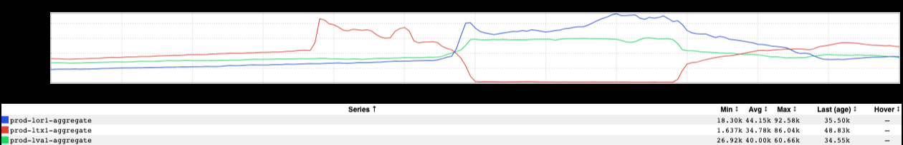
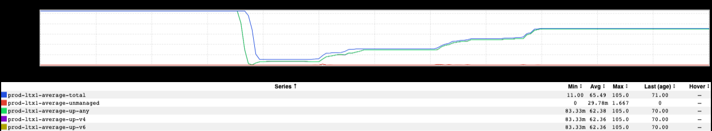
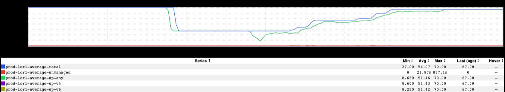

+++
title = "Cause & Effect II"
date = "2023-02-10"
slug = "cause-effect-ii"
draft = false
+++

_It's been a little over 5 years since I wrote inGraph of the Week - Cause & Effect_, talking about inGraphs that show...well...a cause and a subsequent effect. Sometimes it can be difficult to disentangle those two things, though. I'd like to walk through a [recent GCN](https://jira01.corp.linkedin.com:8443/browse/GCN-38198) that was an example of this phenomenon. Take a look at this:

Yikes - that's a pretty big spike in errors. Someone should probably look into that, eh? Someone did, and came across this:

Huh. Okay, so eis-backend started hammering on that endpoint in ltx1 and knocked the downstream over, yeah? ...and then we failed out of ltx1 and the problem just migrated its way to Oregon. Seems pretty cut-and-dried, so let's focus in on figuring out where this influx of additional traffic came from! Maybe there was a lix ramp or a deploy or something...

...but what said Someone *didn't* know at the time is that a rogue script was out there [whacking instances of the downstream](https://jira01.corp.linkedin.com:8443/browse/GCN-38199). ...which looks a little like this:

A-ha. So what *actually* happened: this script decimated the downstream service's footprint, at which point the service was severely under-provisioned and started spewing errors...at which point the upstream started retrying. That script was also busy shenaniganizing lor1:

...but not quite as severely; the service still had enough of its footprint to continue limping along. That is, until we failed out of ltx1, pushing enough traffic into lor1 to overload the service there, with the same subsequent spewing of errors and increase in retry traffic.

So what we originally though was the *cause* of the breakage - a sudden spike in traffic - turned out to be the *effect*, just a symptom of the thing that had actually gone wrong.

[I suppose it's true what they say about hindsight](/igotw/2016-07-28-hindsight/) being 20/20...
