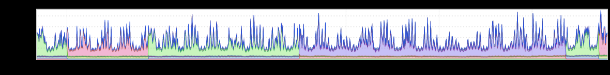
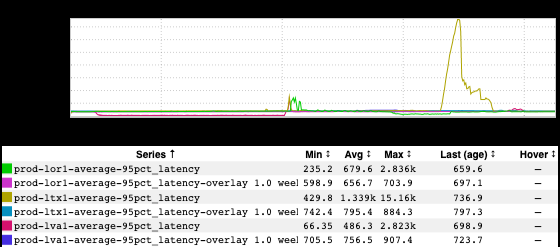
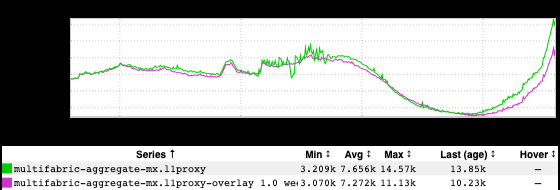

+++
title = "Unintentional Art (February 2023)"
date = "2023-02-17"
slug = "unintentional-art-february-2023"
draft = false
+++

Let's take a peek through the backlog, shall we?

I really like the aesthetic of this one. tl;dr: it's a single-primary service with a manual mechanism for changing what fabric the primary is in. To be clear: You should not architect your service in this way if you can help it. However, it makes for some nifty inGraphs:

I actually have no idea what this one is, but I dig its static:

Continuing in the vein of inGraphs that are Punk AF, here's a lewd lil guy:

...and, last but not least, because the Super Bowl was last weekend (Superbowl? SuperBowl? Am I going to get sued for both infringing upon trademark *an* *d* capitalizing it incorrectly?)  I'd like to answer the question of "Do people in Mexico watch the Super Bowl?"

Worth noting: this inGraph *also* answers the question "Do people in Mexico like Rihanna and/or get stoked for halftime entertainment?"

The answer - to both questions - would appear to be "Yes."
