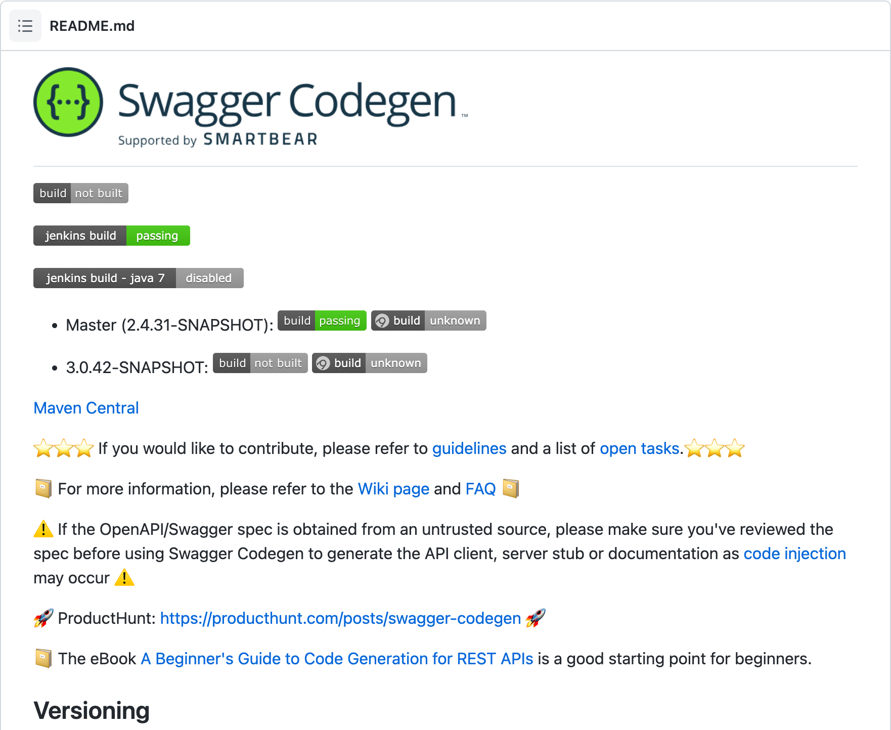
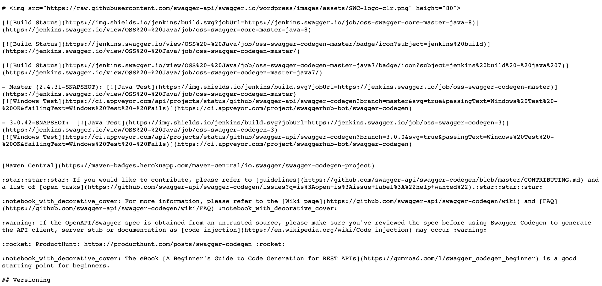

+++
title = "README.md"
date = "2023-03-10"
slug = "readme-md"
draft = false
+++

I'd like to take a moment to mourn the passing of a beloved open source convention: the README file. The humble README was so simple, so elegant - just a little text file, placed directly in-tree right alongside the code - with a name that demanded precisely what was meant to be done with it. A few instructions on how to build/use the thing, some warnings about caveats or gotchas or outright bugs, perhaps an email address or pointer to a website where one might look for help. Och, she was a glory.

Then, along came Markdown. As tech goes, I *love* Markdown. It's straightforward, easy to both read and write (even for non-technical users), and to a large degree just encapsulates plaintext conventions that have long been in use (e.g., using asterisks in plaintext files to denote bullet lists, leading/trailing underscores for emphasis, etc). Folks started tossing a .md file extension onto their README files, but that wasn't a big deal and actually provided a helpful differentiation hint, both for The Humans *and* for The Computers.

Then, along came GitHub. Again, as SaaS offerings go, I *love* GitHub. My list of grievances with git proper is a topic for another post, but I daresay GitHub is nothing short of a triumph in that it has somehow figured out how to make version control *a joy to use.* For historical context, I doubt that anyone has ever used the term "CVS" and "joy" in the same sentence before; the closest they may have come is "Well, I guess it's better than having a directory full of files like main.c.1, main.c.2, main.c.unfuck, main.c.1996-03-14, etc." Similarly, I suspect the best thing that has ever been said about Subversion is "Well, I guess at least I never have to use CVS again."

...and *then* these two technologies - Markdown and Github - came together and birthed (or, perhaps, "enabled")...something unholy.

Somewhere along the way GitHub implemented a feature whereby if a README.md file exists it will automatically be rendered below the directory listing. This is a lovely feature (see: what I said about "joy" above), and it looks something [like this](https://github.com/swagger-api/swagger-codegen/blob/master/README.md):

<sigh> However...the upshot - the real kick in the pants, and the reason for this post - is what it means for the [README.md:](https://raw.githubusercontent.com/swagger-api/swagger-codegen/master/README.md)

My God.

What have we done?

...and so: farewell, sweet README. We hardly knew ye.
