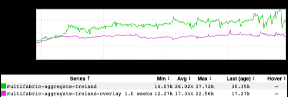

+++
title = "Ireland"
date = "2023-03-17"
slug = "ireland"
draft = false
+++

In honor of St. Patrick's Day I wanted to try and find an inGraph having something to do with Ireland. Grepping around a bit yielded some defunct Cedexis _dashboards, some defunct holden Catchpoint dashboards, and a handful of IDB2_ dashboards...also - you guessed it - defunct. (*Side Note: I'd be curious to* *know what percentage of existing dashboards are actually* funct *at this point; my suspicion is that they're in the minority.)*

Then I came across [this lil guy](https://ingraphs.prod.linkedin.com/dashboard/traffic-religion/), tracking l1proxy traffic for the "big three" religions - Catholic, Muslim, and Hindu - presumably for the purposes of understanding what the impact to site traffic looks like on major religious holidays.

"But Cliff," you might ask, "*surely* l1proxy doesn't know from religion." And you would be correct (thank God, Allah, *and* Vishnu). But what l1proxy *can* do is infer the originating country of the request via geoip lookup, which can then be grouped by countries with predominantly Catholic/Muslim/Hindu demographics.

In short, it is a proxy for a proxy for a proxy. *(See what I did there?)*

The list of predominantly-Catholic countries being used is: Belgium, Brazil, Chile, France, Italy, Mexico, Spain, and - you guess it! - Ireland.

It's perhaps worth noting that a Northern Irishman of a certain age might take umbrage at being placed into a Catholic bucket. My apologies. My intent isn't to...err...umber anyone, I'm just reporting on what I've found.

So! After fiddling a bit with a test dashboard to remove the other countries, here we have it - site traffic coming from IP addresses that indicate the requests originated from somewhere in Ireland:

Nifty.

Happy St. Patty's Day, folks. *Sláinte!*
