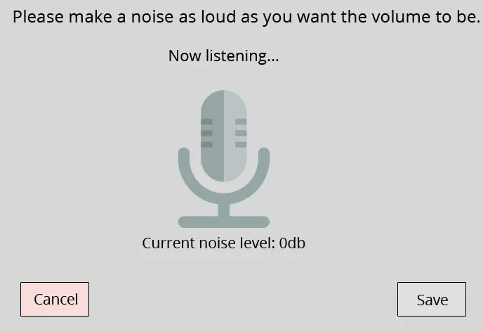

+++
title = "Volume"
date = "2023-04-07"
slug = "volume"
draft = false
+++

An amusing [twitter thread caught my eye this week. It's a picture dump of a 2017 competition to come up with the worst possible volume control interface. ](https://twitter.com/0xDesigner/status/1642554817590566915) The entries - for the most part - fall into one (or more) of a few buckets:

Mini-games: 1, 2,  , 9, 11, 12, 17**5** Presenting every possible option: 3, 21 RNG: 4, 6, 18 Diabolically (perhaps even *physically*) difficult to adjust: 7, 10, 14, 15, 16, 20, **22** Pure absurdism: 13, 19

[As mini-games go, I'd personally give #5 (the curling one) Best-in-Show, and the award for "made me want to cry the most" might be ](https://twitter.com/0xDesigner/status/1642554825672990720)[#22.](https://twitter.com/0xDesigner/status/1642554856303910912)

[The astute reader might have noticed that #8 does not appear in any of the categories above.](https://twitter.com/0xDesigner/status/1642554830748098560)

I'm actually quite enamored of this one. It's perhaps a bit situational - if you're trying to crank your Spinal Tap to 11 then it could be considered "difficult to adjust" - but for common use cases like adjusting the volume for a VC call? What could be more natural than "speak into the mic at the volume you'd like it [to be"? It's brilliant, in an almost Giertzian](https://www.youtube.com/watch?v=c0bsKc4tiuY) kind of way.
