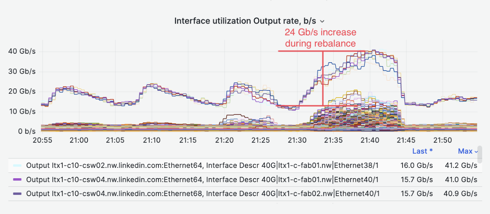
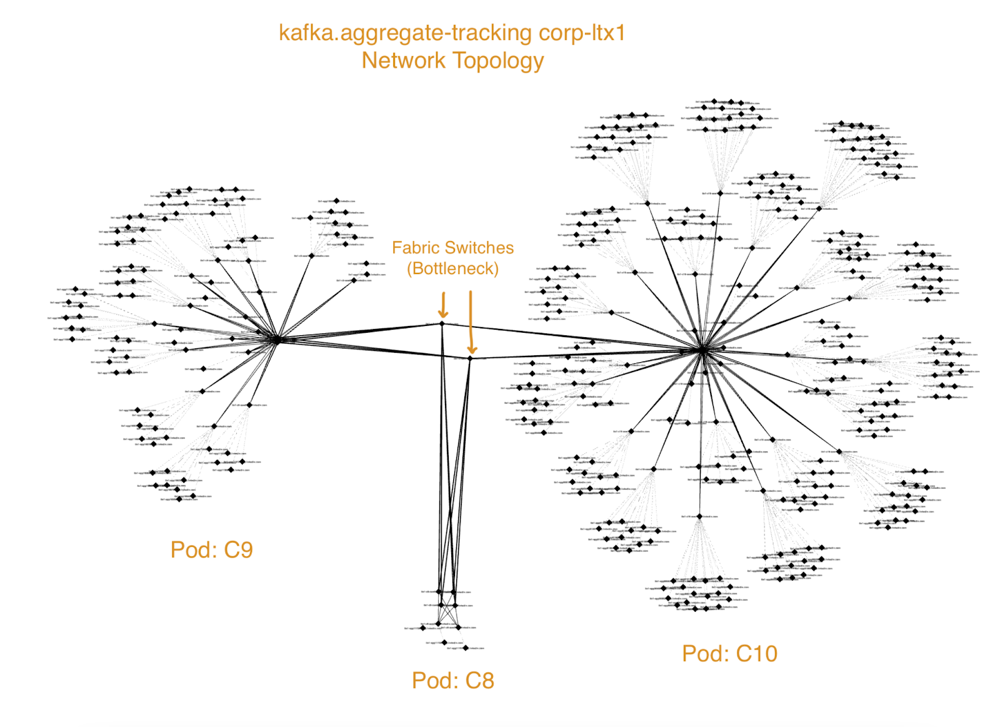

+++
title = "Saturation"
date = "2023-04-15"
slug = "saturation"
draft = false
+++

This week's igotw brought to you by _Nick Garvey_ and this [write-up of ](https://docs.google.com/document/d/1DcR2o4YpKtOkh1qWF5szYPURW5TJT8U0gMD5Cx98Qs0/edit?pli=1)[GCN-38509 (network saturation caused by kafka cluster rebalances). First, we've got ](https://jira01.corp.linkedin.com:8443/browse/GCN-38509) switch interface output:

...and then, the network topology demonstrating where the bottleneck is:

I'm going to keep this one short - just a teaser, really - but there are some other goodies in the doc. Enjoy!
