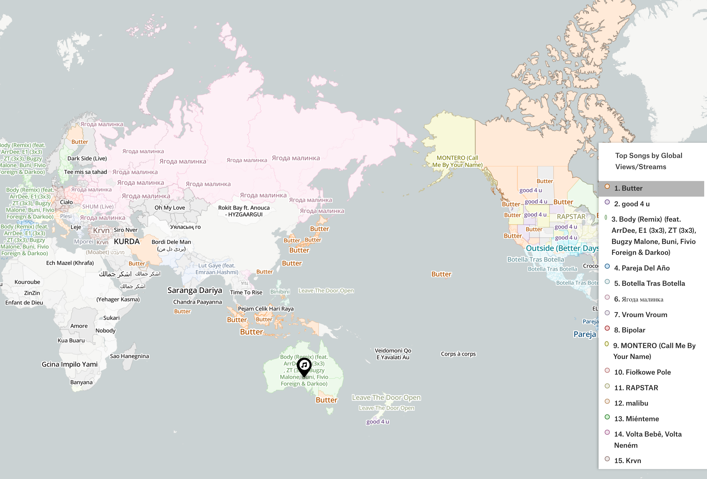
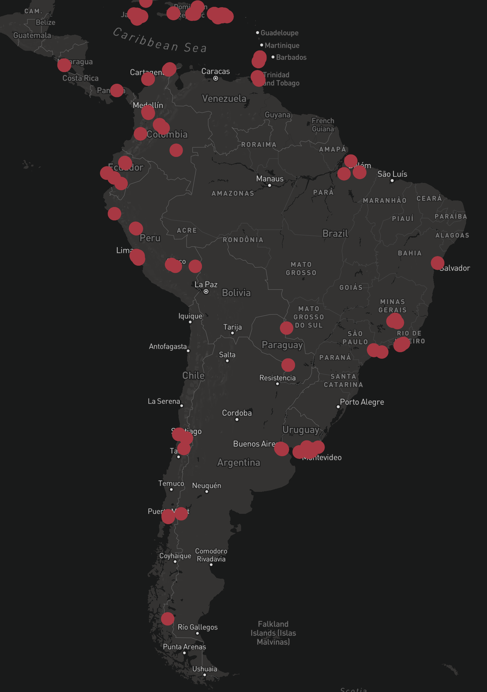
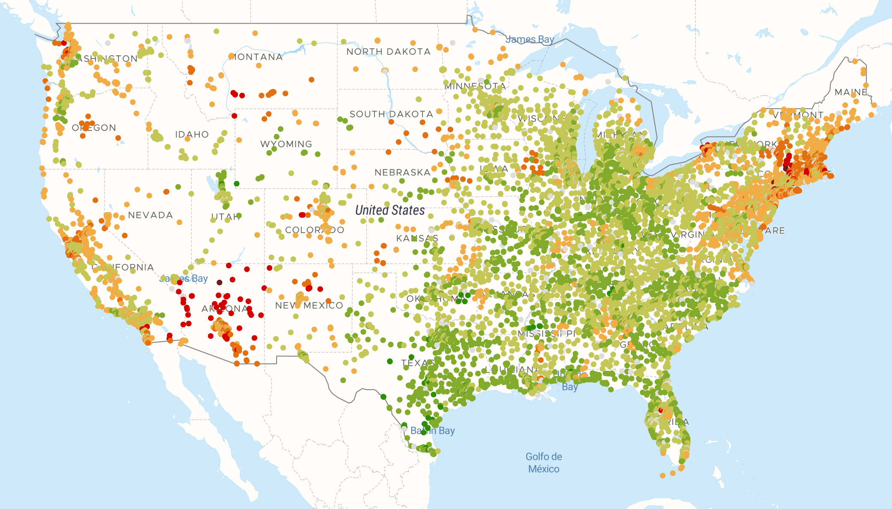

+++
title = "Maps (April 2023)"
date = "2023-04-28"
slug = "maps-april-2023"
draft = false
+++

If you've been reading for a while it should come as no surprise that I have a bit of a penchant for maps (see: [here ](/igotw/2019-02-01-maps/)_here _[here ](/igotw/2020-05-01-cartography/)_here __here_, [, , ](/igotw/2020-05-01-cartography/)_, __...etc.) I have a _ few in my backlog of igotw ideas that I'd like to share today.

[First off, we've got Watercolor Maptiles - an open-source mapping tool that displays map data in the style of a watercolor painting. The online version has ](https://watercolormaps.collection.cooperhewitt.org/#12/39.9808/-82.9853) all the features you'd expect - zoomable, pannable, etc. - just with a watercolor aesthetic:

Och, it's lovely.

Next up: this [interactive music map](https://pudding.cool/2018/06/music-map/?date=202106) that shows local #1 hit songs based on region. It's admittedly a bit dated at this point - it only has data from 2018-2021 - but I still think it's pretty rad.

Also in the space of culture: this [map of every restaurant Anthony Bourdain visited](https://www.anthonybourdainworldmap.com/). (Hint: Duder went to *a lot* of restaurants...)

Continuing with "food"-related maps (at least nominally), we've got [McCheapest - a map that tracks the price of a Big Mac across the US:](https://pantryandlarder.com/mccheapest)

...and lastly: this one is a week late (Environment inDay was *last* Friday), but here's the [One Earth Navigator](https://www.oneearth.org/navigator/) - an interactive globe that enables exploration of the world's bioregions:

Nifty!
