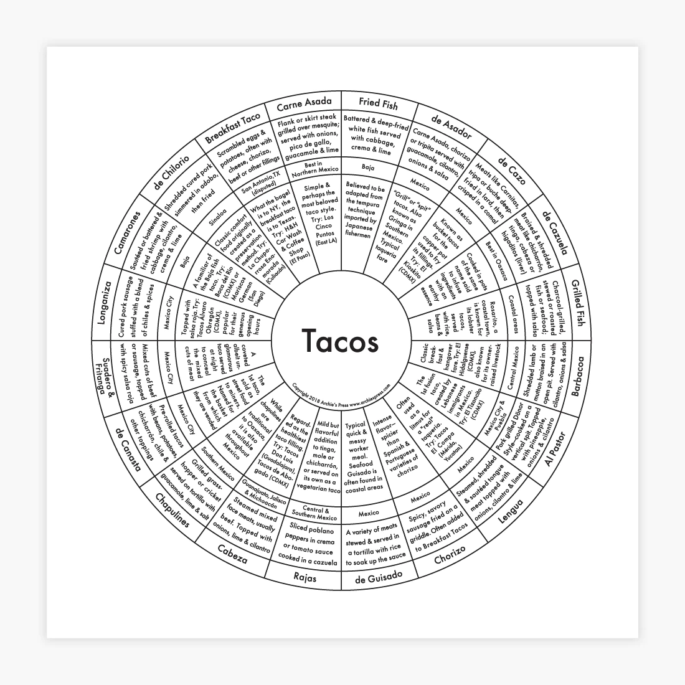

+++
title = "Cinco de Mayo"
date = "2023-05-05"
slug = "cinco-de-mayo"
draft = false
+++

In honor of [Cinco de Mayo, I present you with this lovely ](https://en.wikipedia.org/wiki/Cinco_de_Mayo)[chart describing types of tacos](https://archiespress.com/products/taco-chart):

Also, an interesting tidbit from Wikipedia: *"According to Nielsen, in 2013 more than $600 million worth of beer was purchased in the United States for* *Cinco de Mayo, more than for the Super Bowl or St. Patrick's Day."*

Happy birthday, LinkedIn; you're not *quite* old enough to drink yet (in the United States, at least). Next year.
