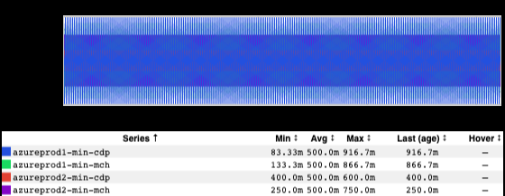
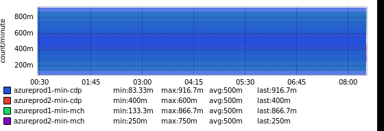
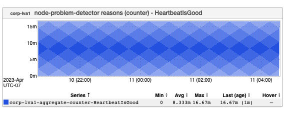
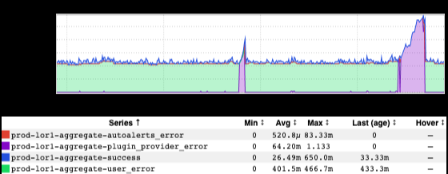
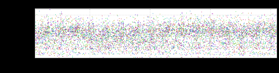
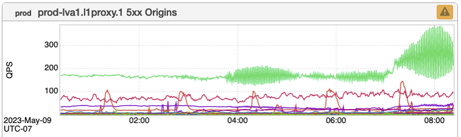

+++
title = "Unintentional Art (May 2023)"
date = "2023-05-12"
slug = "unintentional-art-may-2023"
draft = false
+++

Due to a bit of a home re-org I'm displaced this week - which is to say, sans office (I'm writing this at my dining room table). So...opportunity to unload (unleash?) a few bits 'n' bobs from my inGraph backlog. Let's see what we've got.

First up - in rapid succession, a few examples of the _Moiré Effect__ that were sent my way by John Wingenbach__ and Mykyta Gubenko :_

All blue. Huh. I'm going to have to start playing around and finding other colors.

Anyhow, this next one I think came from some recent GCN or other but I'm too lazy - and my lower back hurts too much from sitting on this damnable dining chair all week - to go figure out which one:

Then there's this lovely bit of static/confetti:

...and finally, one from _Kenneth Lu_. In his own words: "I think voyager might have become sentient and it's trying to talk to us via ingraphs waveforms?"

Happy Friday, folks!
