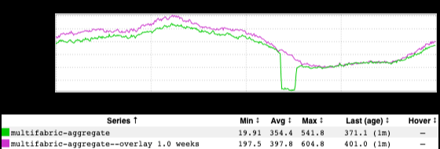
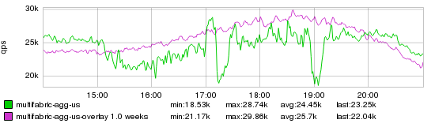

+++
title = "On Alerting"
date = "2023-05-25"
slug = "on-alerting"
draft = false
+++

[The below is an inGraph of a Thing that broke](https://jira01.corp.linkedin.com:8443/browse/GCN-38851):

Said Thing broke for about an hour, and unfortunately in this particular case nobody noticed until a couple of hours later. The Thing was an important one, so some questions were asked around gaps in monitoring/alerting. Those kinds of questions are common and reasonable - I mean, if the above graph exists then surely we should be able to set up an alert on that metric so we can catch this the next time, right?

Maybe. Let's poke at a couple of ways we might go about alerting here.

In an ideal scenario, we'd know exactly what the metric should be doing - exactly what number to expect for any given time slice. If we had that, then we could alert if the number we see deviates from the number we expected to see. Unfortunately, this is vanishingly rare. In this case, that would boil down to basically knowing how many people are "supposed to be" sending a member-to-member invitation at any point in time. (If there's someone out there who can accurately do that then you're not being paid *nearly* enough money.) This scenario also suffers from "[now you have ](/igotw/2021-08-06-two-problems/)[*two* ](/igotw/2021-08-06-two-problems/)[problems](/igotw/2021-08-06-two-problems/)" a bit, in that it's now sensitive to either the "input" *or* the "output" metric breaking/reporting inaccurately.

Since we don't know what number to expect, let's take a look at the data we *do* have. We can see by the Min value that it never actually went to zero, so we can't just alert on that. I suppose we could maybe select some threshold greater than zero, but it's not obvious how we'd choose a meaningful threshold that would both catch breakage *and* not go off "on Christmas at midnight". In the above inGraph, the green is the current week and the fuchsia is the prior week (commonly called week-over-week or WoW). We might notice that these tend to track pretty closely, so maybe it would make sense to set up an alert based on whether the traffic we see *this* week diverges from what we saw *last* week - perhaps within some tolerance. This is almost always a terrible idea. There are *so many things* that can make metrics based on member traffic vary significantly from week to week. World events. Holidays. Daylight Savings Time. If you're alerting based on week-over-week for these kinds of metrics then you're either going to have such loose tolerances that you're unlikely to catch real breakage, or you're going to get spurious pages All. The. Time. (Or, most likely, both.)

A keen observer might notice that the inGraph is relatively regular/smooth, which might suggest alerting on sharp/sudden changes in magnitude - perhaps sustained over some amount of time to account for jitter. I'm not actually sure how one would go about doing this in inGraphs (if you know how I'd love to hear it), but I think this is possibly the best approach. It comes with the caveat that it wouldn't catch slow degradation over time, but it should catch this particular failure case.

[...and, sadly, it could very well ruin your Superbowl party:](/igotw/2016-02-11-the-superbowl/)

<sigh> Alerting is hard.
