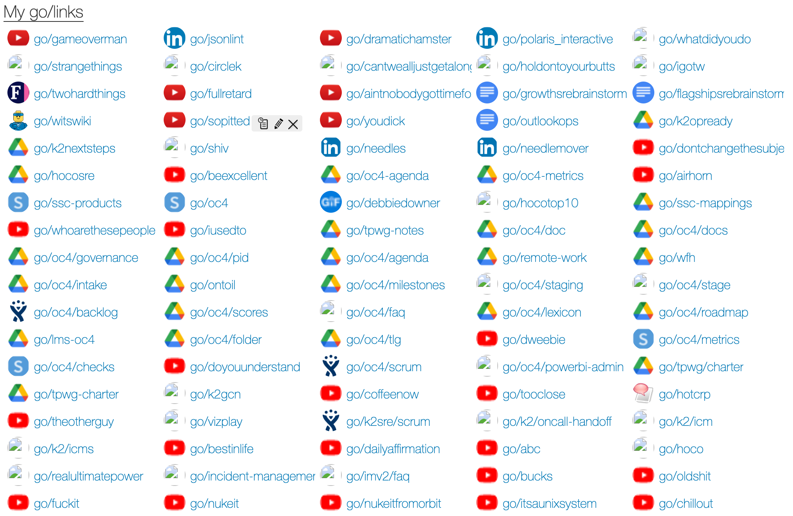

+++
title = "Go Links"
date = "2023-06-02"
slug = "go-links"
draft = false
+++

Over time I've amassed a decently large number of go links - 90 of them in all, if I'm counting correctly:

A fair number of these are defunct by this point - I'd guess about half. Of the ones that aren't either pointing at something outdated or just outright broken, I'd say perhaps a bit less than half are work-related, and a bit more than half are "fun". If I had to choose a favorite it might be _go/circlek_...which actually has a fair bit of situational utility, in a meme-ish sort of way.

_Anyhow, if you haven't had the opportunity to create a go link just yet, I'd highly recommend it. Just go to...well...go/go_. It's pretty straightforward - there's a bit at the top that looks like so:

...and which works in precisely the expected way. If you're worried about stepping on someone else's go link in a Wild West uncontrolled namespace, don't sweat it; it'll tell you if an alias has already been taken, who currently owns it, and confirm "Are you *sure* you wanna step on Duder's alias?" before over- writing. It also emails the previous owner if you decide to pull the trigger, so be a good citizen *but also* know that your action will probably not go unnoticed - particularly if you're overriding an important/frequently-used go link. (Remind me to tell you about That One Time some time...)

Anyhow - happy Friday, and happy go-linking!
