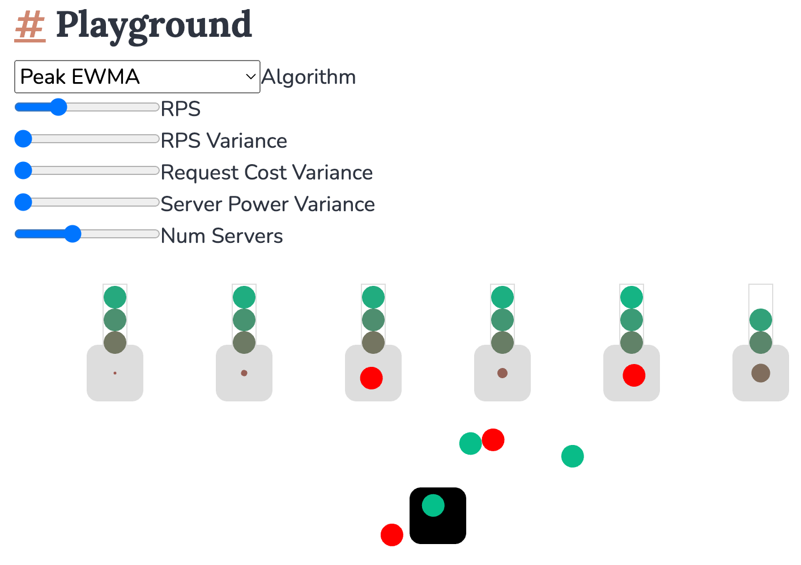

+++
title = "Load Balancing"
date = "2023-08-09"
slug = "load-balancing"
draft = false
+++

_Over the years I've posted a handful of times about load balancing strategies and __when they break_, but I don't think I've ever talked about what load balancing *is* - what its fundamentals are, how it Works. Today I'd like to allow [Sam](https://samwho.dev/) to do so for me *viz* his ['splainer on load balancing. In it, he explores the ](https://samwho.dev/load-balancing/) concept and outlines several algorithms, including nifty little visualizations that demonstrate how they work (albeit on a small scale) and what their tradeoffs are.

It is by no means exhaustive (which I consider to be a "feature" - something like this could get really long, really quickly), but for a high-level reasonable- length overview I think it's most excellent.

...and - bonus! - it comes with a little [playground](https://samwho.dev/load-balancing/#playground), where you can twiddle a few knobs and see what impact they might have on any of the half-dozen algorithms described in the post.

Noice.
