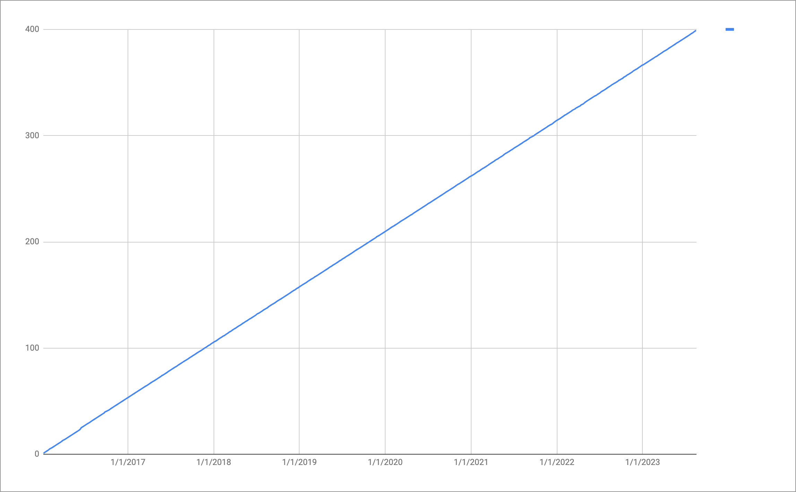

+++
title = "Milestones"
date = "2023-08-24"
slug = "milestones"
draft = false
+++

Last Sunday my oldest daughter turned 11. Yesterday was her first day of middle school. She changes classes and has a locker and…well…she’s still a kid, but she’s kinda gone [Full Corinthians](https://www.biblegateway.com/passage/?search=1%20Corinthians%2013%3A11&version=KJV) on me (so to speak).

[In May we celebrated LinkedIn’s 20th birthday. My 10-year work anniversary is right around the corner - I started in September of 2013 - so I’ve been ](https://www.linkedin.com/business/marketing/blog/trends-tips/this-week-in-marketing-linkedins-birthday) around for (slightly) more than half of the company’s existence.

Wild.

…and this, gentle reader, is my 400th igotw post.

_If you’d asked me in January 2016_ where I thought this was going to go, I think I probably would’ve said “I’m going to try this out for a bit and see what happens.” I doubt that I would’ve had the optimism to imagine that nearly 8 years later I’d have posted once a week, every week, without a gap.

I kicked around a few ideas about what to write for this particular milestone.

I had one concept involving the “difference between ‘every time’ and ‘some of the time’” that I was fairly fond of. It probably would’ve had something about how the Grand Canyon was formed, or some adaptation of an old chestnut about “The best time to start a blog is 8 years ago…”

Meh. Maybe some other time.

I also thought about telling some Old Stories. Like the time I was trying to explain to a former colleague about how igotw was an apolitical cultural instrument for the conveyance of et cetera et cetera and some such, and he came back with “I like the ones where you post all those graphs that look like pictures of birds or whatever.”

Humbling. (Much love to roblak, wherever he is now - he has an awful lot to do with why I still occasionally do Unintentional Art posts.)

_So. I guess I’ll just do the usual_ - a graph of posts over time - and leave it at that.

I reckon it doesn’t always have to be exciting. It just has to Be.

…and, once again: thank you for reading.
