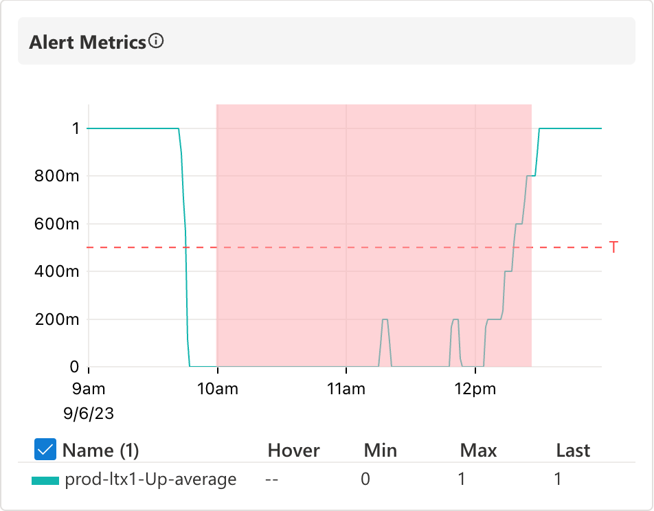
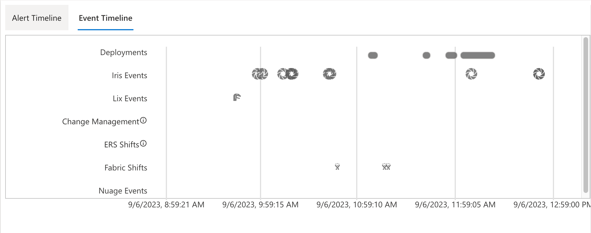
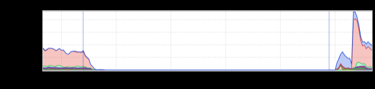

+++
title = "Event Timeline"
date = "2023-09-08"
slug = "event-timeline"
draft = false
+++

A [recent incident clued me in to a feature of ](https://jira01.corp.linkedin.com:8443/browse/GCN-39361)[Observe that I didn't realize existed. If you click through that, the "base" view includes things like this:](https://observe.prod.linkedin.com/triage?application=payments-vault&end=1694019540&event=12985340314726511493&fabric=prod-ltx1&start=1694005161)

...which is a nice at-a-glance view of the duration of the incident (with the red bits being when the alert(s) were firing). The thing I *didn't* know about was the "Event Timeline" tab:

It's a bit small, and doesn't show up directly on the graph the way _informed overlay_ would - e.g.,:

...BUT, you see that lil icon in the "Lix Events" row just to the left of the 9:59:15 line?

That lil dino head (clever girl) happens to represent the lix ramp that ended up being the cause of the incident. What's nice about this is that this shows up automatically (based on the service name, I believe) without having to explicitly search for it (as compared to informed overlay, where you would have to know what you were looking for and manually input the service/product name). Same goes for deployments and other kinds of events. Neat!

I'm not super-clear on why the lix termination that mitigated the incident doesn't also show up (maybe it only pulls in activations and not terminations?), and the UX could use a bit of love (that's a teeny-tiny lil 'Rex on a big ol' field of white, and it's damned hard to visually correlated it timeline-wise at-a-glance), _but those are details that can be sorted over time. On the whole this is pretty nifty - nice work, Observe team!_
