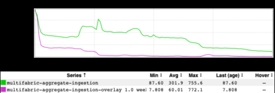
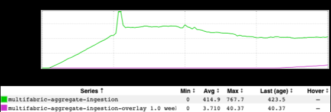
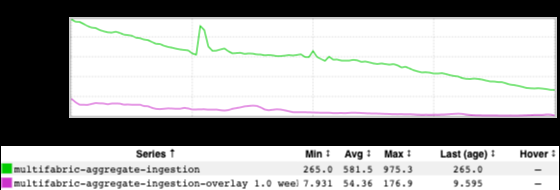
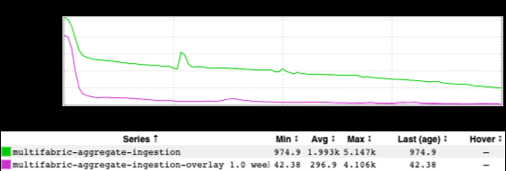
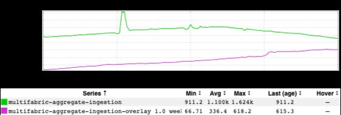
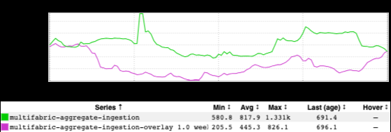

+++
title = "Unintentional Art (September 2023)"
date = "2023-09-20"
slug = "unintentional-art-september-2023"
draft = false
+++

_Today's igotw comes 100% from a recent KBMI (Key Business Metrics Intraday) follow-up email. For those uninitiated with KBMI (and too lazy to click the _ link), it's a report tracking important business metrics. It is sent out hourly via email, and is highly-scrutinized for deviations.

Also, sometimes follow-up investigation on these reports produces a set of inGraphs that kinda-sorta look like animals.

Let's dive in, shall we? To me this one looks like a unicorn with a badonkadonk trying to hide under a blanket (or maybe behind a bush):

...and, similarly, I think this one is a horse with an exceptionally long nose. We shall call him...Cyrano de Horserac:

The next few put me in mind of various breeds of shark - the long, pointy kind. ...maybe like...sand tiger sharks? Or sawsharks? Hell, I dunno - I'm no sharkeologist:

...and, finally, this one makes me think of a dragon with a head that is absurdly disproportionate to its neck. It also kinda reminds me of Flotsam & Jetsam from The Little Mermaid...but mostly the dragon thing:

Happy Wednesday, folks.
