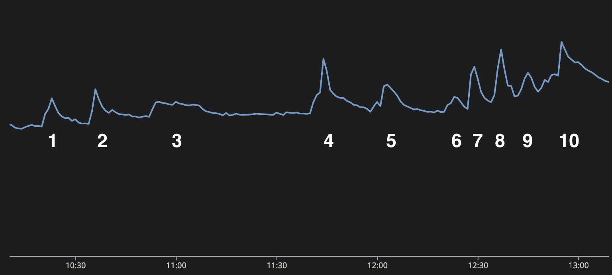

+++
title = "Discord"
date = "2023-11-03"
slug = "discord"
draft = false
+++

Earlier this year I came across a write-up on [How Discord Stores Trillions of Messages. The author talks through scaling challenges Discord had with ](https://discord.com/blog/how-discord-stores-trillions-of-messages) Cassandra, their subsequent architecture change and migration to ScyllaDB, and some pretty impressive performance and maintainability gains they achieved by doing so. ...but the main reason it caught my eye was this:

This is Discord's message send graph during the [2022 World Cup final](https://en.wikipedia.org/wiki/2022_FIFA_World_Cup_final), punctuated by events of interest in the match. This is similar to the kind of impact [LinkedIn sees during big sporting events like the Superbowl](/igotw/2016-02-11-the-superbowl/), with the notable difference that our site traffic tends to go *down* during these events while Discord's metrics tend to go *up* - perhaps unsurprising for a social chat platform.

Anyhow, I just thought it was cool to see this bird-of-a-feather posting "in the wild". (heh I also loved the bit about 'We weren’t “watching soccer during meetings”, we were “proactively monitoring our systems’ performance.”' I hear ya, buddy. I hear ya.)
