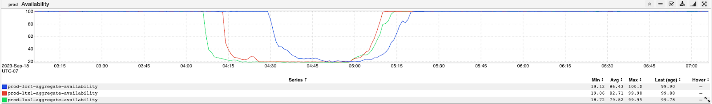
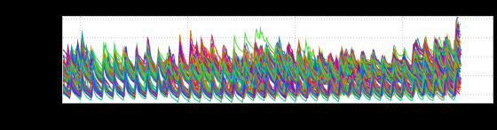
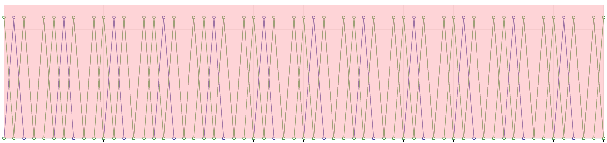
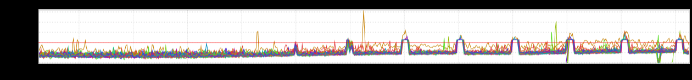
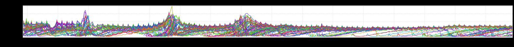

+++
title = "Unintentional Art (November 2023)"
date = "2023-11-11"
slug = "unintentional-art-november-2023"
draft = false
+++

Just a few bits 'n' bobs I've got laying around in my stash this week.

[First up, this depiction of GCN-39427](https://jira01.corp.linkedin.com:8443/browse/GCN-39427) that looks like a stack of upside-down cowboy hats:

I'm almost certain this next one was also from a GCN - notice how the metric just completely stops metric-ing toward the right edge - but I'm at a bit of a loss as to which one:

_This one is from Observe. I don't actually know what it _*means*, but the overall aesthetic makes me think of bowling alleys:

This next one gives me anxiety. Like...I don't know exactly what's happening every hour, on the hour...but there's impending doom here, and Someone had better Do Something:

...and finally, as a bit of a "palate cleanser" there's this soothing lil jawn that _Stufflebiscuit_sent my way. Many converge, much smoothen...all's well that ends well:

