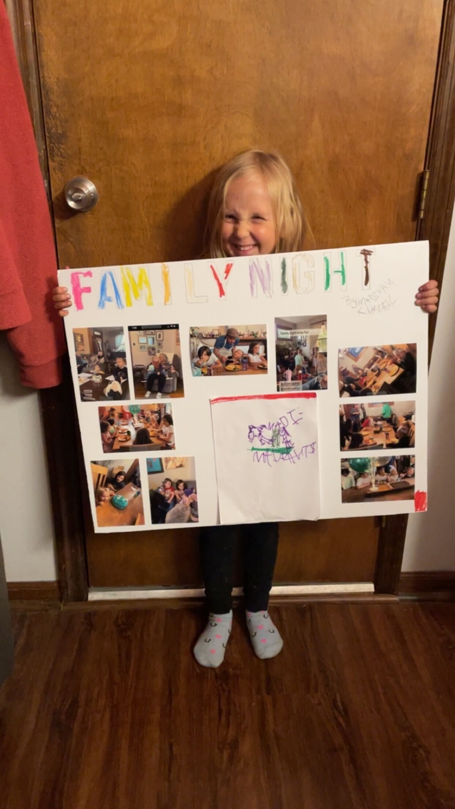

+++
title = "Family Night (Redux)"
date = "2023-11-22"
slug = "family-night-redux"
draft = false
+++

I've talked about _Family Night_ before. I thought the night before (US) Thanksgiving might be a good time to swing back around to it. So far as I'm concerned Thanksgiving is an annual version of what I strive for weekly with Family Night (albeit with decidedly less turkey and fewer awkward conversations about politics with That One Uncle).

...so...check this out:

This is my niece Madigan. She had a school project to present her "favorite family tradition or day of the year"...and what she picked was Family Night.

In case you aren't a connoisseur of child art, the drawing at bottom-center is a depiction of Uncle Cliffy picking her up and calling her "Madi Mad-Pants".

...and no, I'm not crying, *you're crying*.

Happy Thanksgiving, folks. I'll see y'all on Monday.
