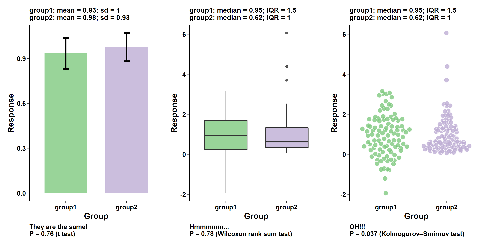

+++
title = "Friends Don't Let Friends"
date = "2023-12-02"
slug = "friends-don-t-let-friends"
draft = false
+++

_I've talked about bad dataviz and chartjunk here before. The _[Friends Don't Let Friends Make Bad Graphs](https://github.com/cxli233/FriendsDontLetFriends) github repo is something a little different. It's not that these charts have unnecessary or distracting decoration, it's more that they're not designed or leveraged in a way that most effectively conveys the data they represent. For example:

Some of them are fairly obvious (like the above), some are a little more subtle. In addition to pretty pictures there is a wealth of information and resources on how to make charts that don't suck. If you're into dataviz, check it out!
