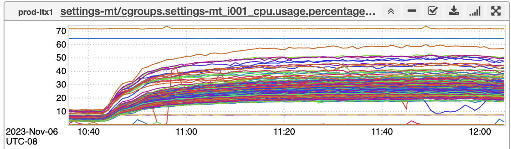
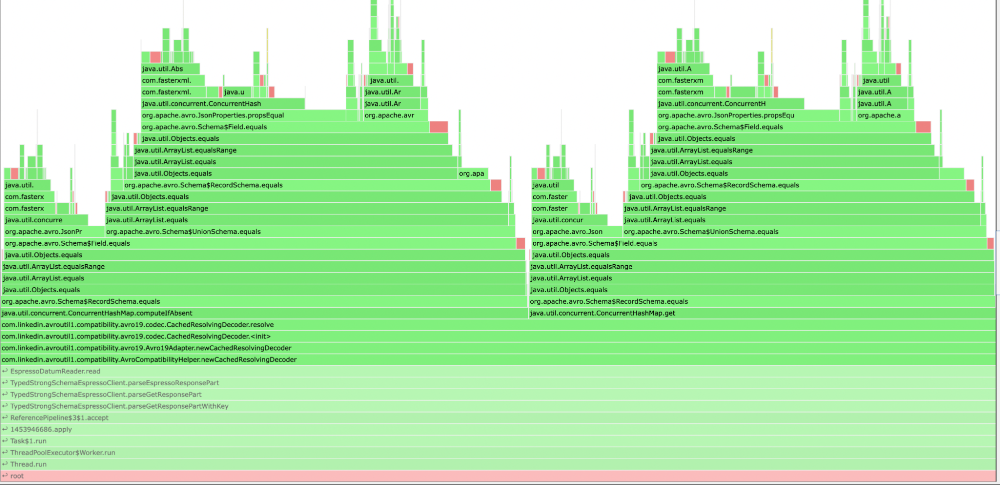
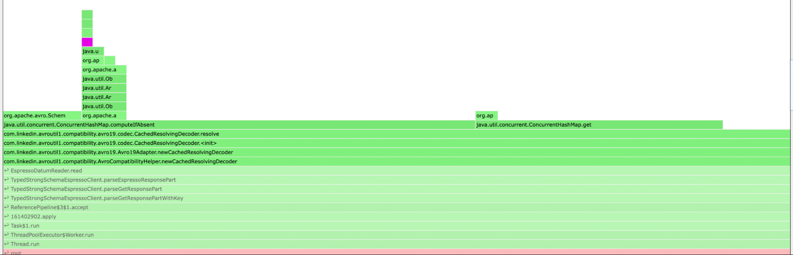

+++
title = "Flame Graphs"
date = "2023-12-17"
slug = "flame-graphs"
draft = false
+++

This week I wanted to pass along a [write-up about a gnarly performance bug ](https://docs.google.com/document/d/189WkkBnHjZBnGtEZSKknfGbYX76X6hpB86EgdBpq_qE/edit)_Stufflebiscuit_ tracked down. He's got a couple of inGraphs in there that are good examples of _banding_:

...and he *also* [includes a couple of flame graphs](https://www.brendangregg.com/flamegraphs.html):

It made me realize I've never posted anything about them before. Invented by [Brendan Gregg[citation needed]](https://en.wikipedia.org/wiki/Brendan_Gregg), these charts are a way of visualizing where a given call stack is spending its time. Read the doc for the details - it's super-short - but the above is the "before" flame graph, and here is the "after":

Stufflebangin'!
